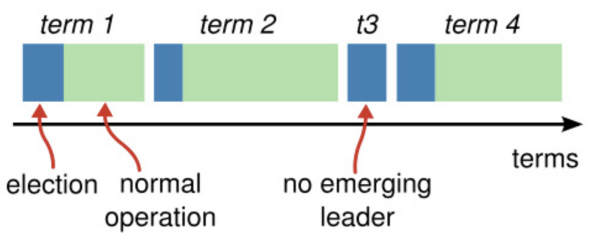
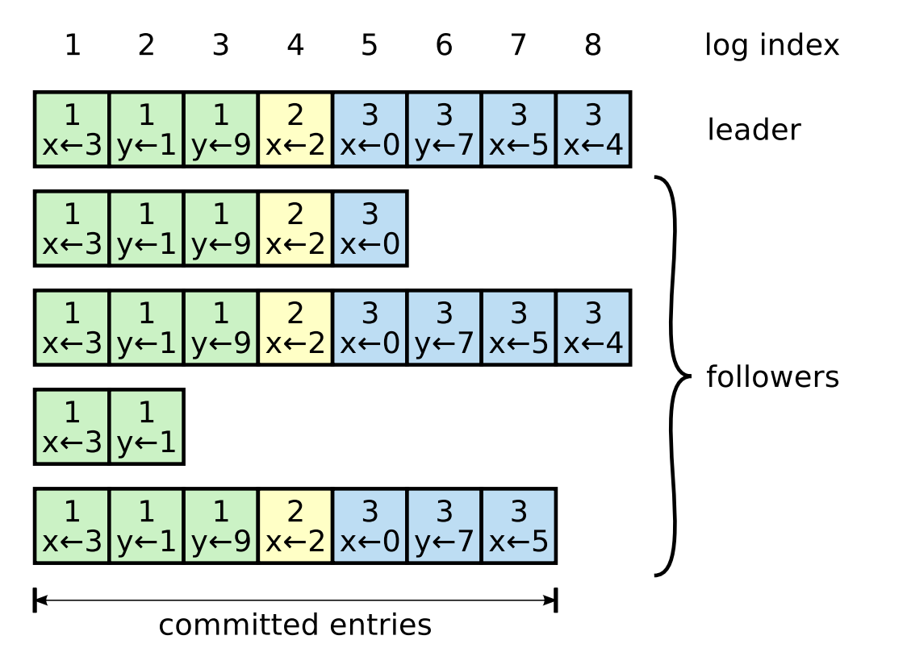
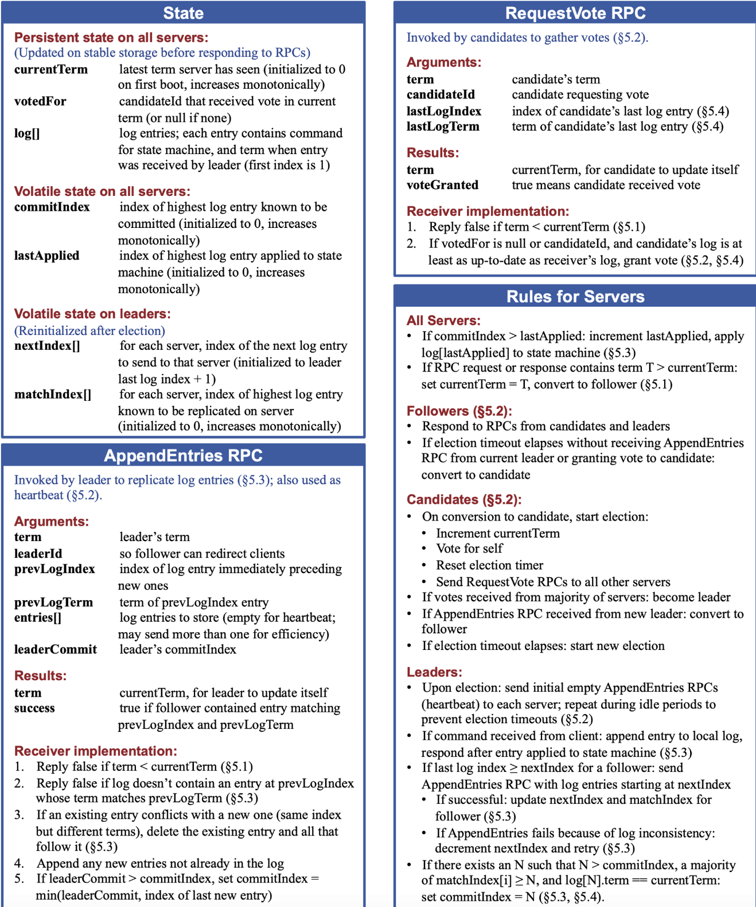
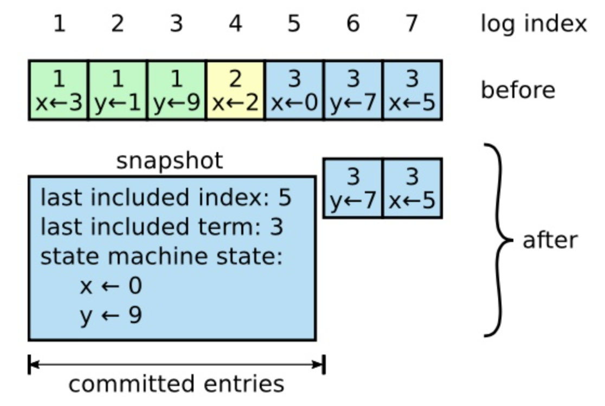
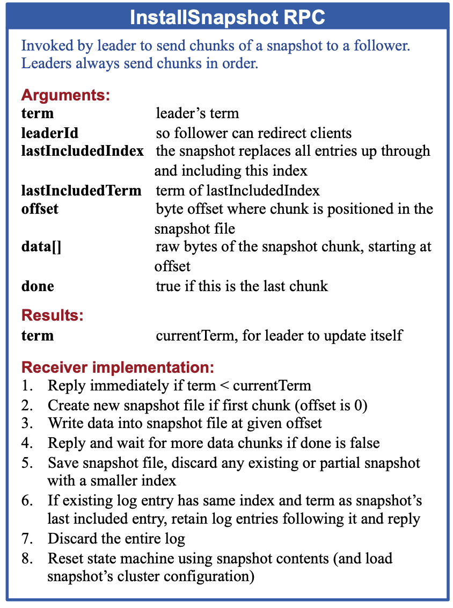
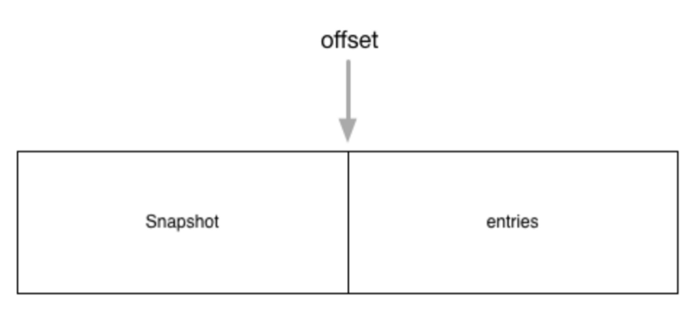
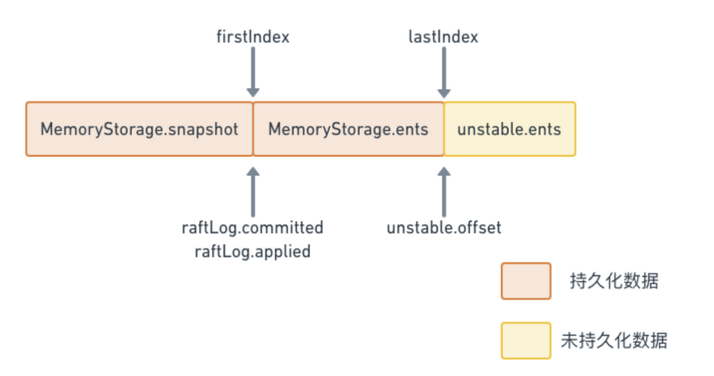
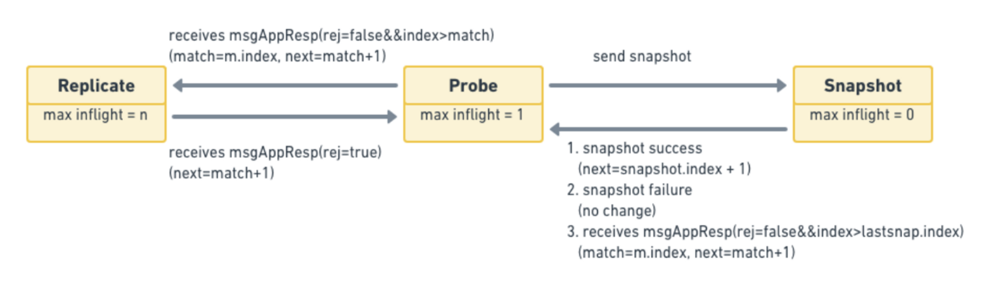
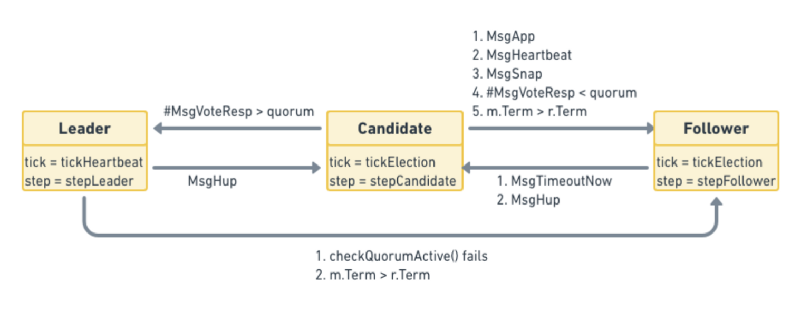

- [概述](#概述)
- [算法](#算法)
  - [Raft基础](#raft基础)
  - [领导选举](#领导选举)
  - [日志复制](#日志复制)
  - [日志压缩](#日志压缩)
- [实现源码](#实现源码)
  - [ETCD中Raft实现](#etcd中raft实现)
    - [数据结构及接口定义](#数据结构及接口定义)
    - [消息处理流程](#消息处理流程)
      - [选举相关消息处理流程](#选举相关消息处理流程)
      - [投票相关消息处理流程](#投票相关消息处理流程)
      - [日志复制相关消息处理流程](#日志复制相关消息处理流程)
- [参考资料](#参考资料)
# 概述
Raft算法是一种用于分布式系统中的共识算法，由Diego Ongaro和John Ousterhout于发布于论文<In Search of an Understandable Consensus Algorithm (Extended Version)>。Raft算法的设计目标是提供一种更容易理解和实现的共识算法，相对于Paxos算法而言更具可读性和可维护性。

Raft算法的设计灵感来源于选举（election）过程中的角色分工，模拟了一种复杂的分布式领导选举系统，包括了领导者（leader）、跟随者（follower）和候选者（candidate）这三种角色。Raft将共识问题划分为多个阶段，如领导者选举、日志复制等，并提供了相应的机制来确保这些阶段的正确性。

# 算法
## Raft基础
Raft 算法在许多方面和现有的一致性算法都很相似（主要是 Oki 和 Liskov 的 Viewstamped Replication），但是它也有一些独特的特性：

- 强领导者：和其他一致性算法相比，Raft 使用一种更强的领导能力形式。比如，日志条目只从领导者发送给其他的服务器。这种方式简化了对复制日志的管理并且使得 Raft 算法更加易于理解。
- 领导选举：Raft 算法使用一个随机计时器来选举领导者。这种方式只是在任何一致性算法都必须实现的心跳机制上增加了一点机制。在解决冲突的时候会更加简单快捷。
- 成员关系调整：Raft 使用一种共同一致的方法来处理集群成员变换的问题，在这种方法下，处于调整过程中的两种不同的配置集群中大多数机器会有重叠，这就使得集群在成员变换的时候依然可以继续工作。

一个 Raft 集群包含若干个服务器节点；5 个服务器节点是一个典型的例子，这允许整个系统容忍 2 个节点失效。在任何时刻，每一个服务器节点都处于这三个状态之一：领导人、跟随者或者候选人。在通常情况下，系统中只有一个领导人并且其他的节点全部都是跟随者。跟随者都是被动的：他们不会发送任何请求，只是简单的响应来自领导者或者候选人的请求。领导人处理所有的客户端请求（如果一个客户端和跟随者联系，那么跟随者会把请求重定向给领导人）。第三种状态，候选人，是用来竞选新领导人时使用。下图展示了这些状态和他们之间的转换关系。


>服务器状态。跟随者只响应来自其他服务器的请求。如果跟随者接收不到消息，那么他就会变成候选人并发起一次选举。获得集群中大多数选票的候选人将成为领导者。在一个任期内，领导人一直都会是领导人直到自己宕机了。
>

Raft 把时间分割成任意长度的**任期**，如下图。任期用连续的整数标记。每一段任期从一次**选举**开始，就像上述描述的一样，一个或者多个候选人尝试成为领导者。如果一个候选人赢得选举，然后他就在接下来的任期内充当领导人的职责。在某些情况下，一次选举过程会造成选票的瓜分。在这种情况下，这一任期会以没有领导人结束；一个新的任期（和一次新的选举）会很快重新开始。Raft 保证了在一个给定的任期内，最多只有一个领导者。

不同的服务器节点可能多次观察到任期之间的转换，但在某些情况下，一个节点也可能观察不到任何一次选举或者整个任期全程。任期在 Raft 算法中充当**逻辑时钟**的作用，这会允许服务器节点查明一些过期的信息比如陈旧的领导者。每一个节点存储一个当前任期号，这一编号在整个时期内单调的增长。当服务器之间通信的时候会交换当前任期号；如果一个服务器的当前任期号比其他人小，那么他会更新自己的编号到较大的编号值。如果一个候选人或者领导者发现自己的任期号过期了，那么他会立即恢复成跟随者状态。如果一个节点接收到一个包含过期的任期号的请求，那么他会直接拒绝这个请求。

Raft 算法中服务器节点之间通信使用远程过程调用（RPCs），并且基本的一致性算法只需要两种类型的 RPCs。**请求投票（RequestVote**） RPCs 由候选人在选举期间发起，然后**附加条目（AppendEntries）**RPCs 由领导人发起，用来**复制日志**和提供一种**心跳机制**。为了在服务器之间**传输快照**增加了第三种 RPC。当服务器没有及时的收到 RPC 的响应时，会进行重试， 并且他们能够并行的发起 RPCs 来获得最佳的性能。



>时间被划分成一个个的任期，每个任期开始都是一次选举。在选举成功后，领导人会管理整个集群直到任期结束。有时候选举会失败，那么这个任期就会没有领导人而结束。任期之间的切换可以在不同的时间不同的服务器上观察到。
>

## 领导选举

Raft 使用一种**心跳机制**来触发领导人选举。当服务器程序启动时，他们都是跟随者身份。一个服务器节点继续保持着跟随者状态只要他从领导人或者候选者处接收到有效的 RPCs。领导者周期性的向所有跟随者发送心跳包（**即不包含日志项内容的附加日志项 RPCs**）来维持自己的权威。如果一个跟随者在一段时间里没有接收到任何消息，也就是选举超时，那么他就会认为系统中没有可用的领导者,并且发起选举以选出新的领导者。

要开始一次选举过程，跟随者先要**增加自己的当前任期号并且转换到候选人状态**。然后他会**并行**的向集群中的其他服务器节点发送请求投票的 RPCs 来给自己投票。候选人会继续保持着当前状态直到以下三件事情之一发生：(a) 他自己赢得了这次的选举，(b) 其他的服务器成为领导者，(c) 一段时间之后没有任何一个获胜的人。这些结果会分别的在下面的段落里进行讨论。

当一个候选人从整个集群的**大多数**服务器节点获得了针对同一个任期号的选票，那么他就赢得了这次选举并成为领导人。每一个服务器最多会对一个任期号投出一张选票，按照**先来先服务(FCFS)**的原则。要求大多数选票的规则确保了最多只会有一个候选人赢得此次选举。一旦候选人赢得选举，他就立即成为领导人。然后他会向其他的服务器发送心跳消息来建立自己的权威并且阻止新的领导人的产生。

在等待投票的时候，候选人可能会从其他的服务器接收到声明它是领导人的附加日志项 RPC。如果这个领导人的任期号（包含在此次的 RPC中）**不小于**候选人当前的任期号，那么候选人会承认领导人合法并回到跟随者状态。 如果此次 RPC 中的任期号比自己小，那么候选人就会拒绝这次的 RPC 并且继续保持候选人状态。

第三种可能的结果是候选人既没有赢得选举也没有输：如果有多个跟随者同时成为候选人，那么选票可能会被瓜分以至于没有候选人可以赢得大多数人的支持。当这种情况发生的时候，每一个候选人都会超时，然后通过**增加当前任期号**来开始一轮新的选举。然而，没有其他机制的话，选票可能会被无限的重复瓜分。

Raft 算法使用**随机选举超时时间**的方法来确保很少会发生选票瓜分的情况，就算发生也能很快的解决。为了阻止选票起初就被瓜分，选举超时时间是从一个固定的区间（例如 **150-300 毫秒**）随机选择。这样可以把服务器都分散开以至于在大多数情况下只有一个服务器会选举超时；然后他赢得选举并在其他服务器超时之前发送心跳包。同样的机制被用在选票瓜分的情况下。每一个候选人在开始一次选举的时候会重置一个随机的选举超时时间，然后在超时时间内等待投票的结果；这样减少了在新的选举中另外的选票瓜分的可能性。

领导人选举是 Raft 中对时间要求最为关键的方面。Raft 可以选举并维持一个稳定的领导人,只要系统满足下面的时间要求：

> 广播时间（broadcastTime） << 选举超时时间（electionTimeout） << 平均故障间隔时间（MTBF）
> 

在这个不等式中，**广播时间指的是从一个服务器并行的发送 RPCs 给集群中的其他服务器并接收响应的平均时间**；选举超时时间就是在后面中介绍的选举的超时时间限制；然后平均故障间隔时间就是对于一台服务器而言，**两次故障之间的平均时间**。广播时间必须比选举超时时间小一个量级，这样领导人才能够发送稳定的心跳消息来阻止跟随者开始进入选举状态；通过随机化选举超时时间的方法，这个不等式也使得选票瓜分的情况变得不可能。选举超时时间应该要比平均故障间隔时间小上几个数量级，这样整个系统才能稳定的运行。当领导人崩溃后，整个系统会大约相当于选举超时的时间里不可用；我们希望这种情况在整个系统的运行中很少出现。

广播时间和平均故障间隔时间是由系统决定的，但是选举超时时间是我们自己选择的。Raft 的 RPCs 需要接收方将信息持久化的保存到稳定存储中去，所以广播时间大约是 **0.5 毫秒到 20 毫秒**，取决于存储的技术。因此，选举超时时间可能需要在 10 毫秒到 500 毫秒之间。大多数的服务器的平均故障间隔时间都在几个月甚至更长，很容易满足时间的需求。

## 日志复制

一旦一个领导人被选举出来，他就开始为客户端提供服务。客户端的每一个请求都包含一条被复制状态机执行的指令。领导人把这条指令作为一条新的日志条目附加到日志中去，然后并行的发起附加条目 RPCs 给其他的服务器，让他们复制这条日志条目。当这条日志条目被安全的复制（下面会介绍），领导人会应用这条日志条目到它的状态机中然后把执行的结果返回给客户端。如果跟随者崩溃或者运行缓慢，再或者网络丢包，领导人会不断的重复尝试附加日志条目 RPCs （尽管已经回复了客户端）直到所有的跟随者都最终存储了所有的日志条目。



>日志由有序序号标记的条目组成。每个条目都包含创建时的任期号（图中框中的数字），和一个状态机需要执行的指令。**一个条目当可以安全的被应用到状态机中去的时候，就认为是可以提交了。**
>

日志按上图展示的方式组织。每一个日志条目存储一条状态机指令和从领导人收到这条指令时的任期号。日志中的任期号用来检查是否出现不一致的情况，同时也用来保证某些性质。每一条日志条目同时也都有一个整数索引值来表明它在日志中的位置。

领导人来决定什么时候把日志条目应用到状态机中是安全的；**这种日志条目被称为已提交。**Raft 算法保证所有已提交的日志条目都是持久化的并且最终会被所有可用的状态机执行。**在领导人将创建的日志条目复制到大多数的服务器上的时候，日志条目就会被提交**（例如上图的committed entries部分 ）。同时，领导人的日志中之前的所有日志条目也都会被提交，包括由其他领导人创建的条目。领导人跟踪了最大的将会被提交的日志项的索引，并且索引值会被包含在未来的所有附加日志 RPCs （包括心跳包），这样其他的服务器才能最终知道领导人的提交位置。一旦跟随者知道一条日志条目已经被提交，那么他也会将这个日志条目应用到本地的状态机中（按照日志的顺序）。

定义的RPC结构及状态转移如下：


> PS: 其中commitIndex代表的是可以被提交的最大index，lastApplied(applyindex)代表的是已经被提交给状态机的最大index。
>
以下是一些重要的概念：
- `currentTerm`，从0开始单调递增，server所知道的最大的Term号。
- `votedFor`，在当前term下收到的候选人的id；不存在记为null；
- `log[]`，log数组，每个元素代表给state machine的命令。
- `commitIndex`，自己的Raft instance中，认为已经被commit的log最高索引值。
- `lastApplied`，被自己的state machine apply了的log最高索引值。
- `nextIndex[]`，（leader已知的）集群中每个节点待接受的日志索引号。
- `matchIndex[]`，（leader已知的）集群中每个节点上已经和自己对齐了的日志长度

>思考1：为什么 Leader 的 nextIndex[] & matchIndex[]不需要持久化？
nextIndex[] & matchIndex[] 他们两个本身就是leader所独有的属性。当他们崩溃后，集群会有其他节点选上；
而其他节点选上时这两个值应当和follower相互沟通后才能准确确认；
leader崩溃恢复后，由于不再是leader了，因此持久化了他们也没有任何意义。因此 nextIndex[] & matchIndex[] 无需被持久化。

思考2: 为什么 lastApplied 和 commitIndex 不需要持久化？
leader 侧的 commitIndex 是根据 matchIndex 算出来的，每当有一条新的日志追加，传播到多数 follower 时，commitIndex 就重新算出来了。follower 侧，重启后初始化为 0，收到 leader 的 appendEntries 心跳，commitIndex 就也跟着得到更新了。

lastApplied 按说是要持久的。原论文是假设 snapshot 在内存中，重启后要重新 replay 整个 log 来重建状态，因此当然 lastApplied 得从 0 开始了（重建到commitIndex）。然而工程上这种 snapshot 的状态肯定是持久化的，不可能从 0 开始重新跑，这个 lastApplied 就该持久了。
>

## 日志压缩

Raft 的日志在正常操作中不断地增长，但是在实际的系统中，日志不能无限制地增长。随着日志不断增长，他会占用越来越多的空间，花费越来越多的时间来重置。如果没有一定的机制去清除日志里积累的陈旧的信息，那么会带来可用性问题。

快照是最简单的压缩方法。在快照系统中，整个系统的状态都以快照的形式写入到稳定的持久化存储中，然后到那个时间点之前的日志全部丢弃。快照技术被使用在 Chubby 和 ZooKeeper 中，接下来的章节会介绍 Raft 中的快照技术。



增量压缩的方法，例如日志清理或者日志结构合并树，都是可行的。这些方法每次只对一小部分数据进行操作，这样就分散了压缩的负载压力。首先，他们先选择一个已经积累的大量已经被删除或者被覆盖对象的区域，然后重写那个区域还活跃的对象，之后释放那个区域。和简单操作整个数据集合的快照相比，需要增加复杂的机制来实现。状态机可以实现 LSM tree 使用和快照相同的接口，但是日志清除方法就需要修改 Raft 了。

尽管通常服务器都是独立地创建快照，但是领导人必须偶尔的发送快照给一些落后的跟随者。这通常发生在当领导人已经丢弃了下一条需要发送给跟随者的日志条目的时候。幸运的是这种情况不是常规操作：一个与领导人保持同步的跟随者通常都会有这个条目。然而一个运行非常缓慢的跟随者或者新加入集群的服务器将不会有这个条目。这时让这个跟随者更新到最新的状态的方式就是通过网络把快照发送给他们。



由领导人调用以将快照的分块发送给跟随者。领导人总是按顺序发送分块。
|参数| 解释|
|----|----|
|term|领导人的任期号
|leaderId|领导人的 ID，以便于跟随者重定向请求|
|lastIncludedIndex|快照中包含的最后日志条目的索引值|
|astIncludedTerm|快照中包含的最后日志条目的任期号|
|offset|分块在快照中的字节偏移量|
|data[]|从偏移量开始的快照分块的原始字节|
|done|如果这是最后一个分块则为 true|

|结果|解释|
|---|---|
|term|当前任期号（currentTerm），便于领导人更新自己|

**接收者实现**：

1. 如果`term < currentTerm`就立即回复
2. 如果是第一个分块（offset 为 0）就创建一个新的快照
3. 在指定偏移量写入数据
4. 如果 done 是 false，则继续等待更多的数据
5. 保存快照文件，丢弃具有较小索引的任何现有或部分快照
6. 如果现存的日志条目与快照中最后包含的日志条目具有相同的索引值和任期号，则保留其后的日志条目并进行回复
7. 丢弃整个日志
8. 使用快照重置状态机（并加载快照的集群配置）

# 实现源码
Raft 有很多种不同的源码实现，包括各种不同的语言，[官网这里](https://raft.github.io/#implementations)列出了目前实现的源码，下面主要讲Go语言实现的etcd-io库。

## ETCD中Raft实现
其代码仓库为在[这里](https://github.com/etcd-io/raft)。

仓库主要源码结构如下:
```
.
├── raftpb
├── doc.go
├── log.go
├── log_unstable.go
├── logger.go
├── node.go
├── progress.go
├── raft.go
├── rawnode.go
├── read_only.go
├── status.go
├── storage.go
└── util.go
```
### 数据结构及接口定义

**raft.pb.go**
raftpb 目录主要定义了相关的数据结构。

`Entry`定义了集群状态机进行更改操作的消息结构。

```
// go.etcd.io/etcd/raft/raftpb/raft.pb.go
type Entry struct {
	Term             uint64    `protobuf:"varint,2,opt,name=Term" json:"Term"`
	Index            uint64    `protobuf:"varint,3,opt,name=Index" json:"Index"`
	Type             EntryType `protobuf:"varint,1,opt,name=Type,enum=raftpb.EntryType" json:"Type"`
	Data             []byte    `protobuf:"bytes,4,opt,name=Data" json:"Data,omitempty"`
	XXX_unrecognized []byte    `json:"-"`
}
```

其中:

- Term：选举任期
- Index：当前这个Entry在整个raft日志中的位置索引。Term和Index唯一标识一个Log。
- Type：当前该消息的类型。目前etcd支持两种类型：[EntryNormal](https://github.com/etcd-io/etcd/blob/v3.3.10/raft/raftpb/raft.pb.go#L47)和[EntryConfChange](https://github.com/etcd-io/etcd/blob/v3.3.10/raft/raftpb/raft.pb.go#L48)，EntryNormal代表当前Entry是对状态机的操作，EntryConfChange则代表对当前集群配置进行更改的操作，比如增加或者减少节点。
- Data：一个被序列化后的byte数组，代表当前entry真正要执行的操作。

Raft集群中节点之间的通讯都是通过传递不同的`Message`来完成的。

```
// go.etcd.io/etcd/raft/raftpb/raft.pb.go
type Message struct {
	Type             MessageType `protobuf:"varint,1,opt,name=type,enum=raftpb.MessageType" json:"type"`
	To               uint64      `protobuf:"varint,2,opt,name=to" json:"to"`
	From             uint64      `protobuf:"varint,3,opt,name=from" json:"from"`
	Term             uint64      `protobuf:"varint,4,opt,name=term" json:"term"`
	LogTerm          uint64      `protobuf:"varint,5,opt,name=logTerm" json:"logTerm"`
	Index            uint64      `protobuf:"varint,6,opt,name=index" json:"index"`
	Entries          []Entry     `protobuf:"bytes,7,rep,name=entries" json:"entries"`
	Commit           uint64      `protobuf:"varint,8,opt,name=commit" json:"commit"`
	Snapshot         Snapshot    `protobuf:"bytes,9,opt,name=snapshot" json:"snapshot"`
	Reject           bool        `protobuf:"varint,10,opt,name=reject" json:"reject"`
	RejectHint       uint64      `protobuf:"varint,11,opt,name=rejectHint" json:"rejectHint"`
	Context          []byte      `protobuf:"bytes,12,opt,name=context" json:"context,omitempty"`
	XXX_unrecognized []byte      `json:"-"`
}
```

其中：

- Type：当前传递的消息类型，它的取值有[很多个](https://github.com/etcd-io/etcd/blob/v3.3.10/raft/raftpb/raft.pb.go#L80)，但大致可以分成两类：(1)Raft 协议相关的，包括心跳MsgHeartbeat、日志MsgApp、投票消息MsgVote等。（2）上层应用触发的，比如应用对数据更改的消息MsgProp(osal)。
- To&From：分别代表了这个消息的接受者和发送者
- Term：这个消息发出时整个集群所处的任期。
- LogTerm：消息发出者所保存的日志中最后一条的任期号，一般`MsgVote`会用到这个字段。
- Index：日志索引号。如果当前消息是`MsgVote`的话，代表这个candidate最后一条日志的索引号，它跟上面的`LogTerm`一起代表这个candidate所拥有的最新日志信息，这样别人就可以比较自己的日志是不是比candidata的日志要新，从而决定是否投票。
- Entries：需要存储的日志。
- Commit：已经提交的日志的索引值，用来向别人同步日志的提交信息。
- Snapshot：一般跟`MsgSnap`合用，用来放置具体的Snapshot值。
- Reject&RejectHint：代表对方节点拒绝了当前节点的请求

**log_unstable.go**
`unstable`数据结构用于还没有被用户层持久化的数据，它维护了两部分内容snapshot和entries：

```
// go.etcd.io/etcd/raft/log_unstable.go
// unstable.entries[i] has raft log position i+unstable.offset.
// Note that unstable.offset may be less than the highest log
// position in storage; this means that the next write to storage
// might need to truncate the log before persisting unstable.entries.
type unstable struct {
	// the incoming unstable snapshot, if any.
	snapshot *pb.Snapshot
	// all entries that have not yet been written to storage.
	entries []pb.Entry
	offset  uint64

	logger Logger
}
```

其中：

- entries：代表的是要进行操作的日志
- snapshot：快照数据，表示状态机在某一时刻的所有状态。
- offset：快照结束的索引

以上三个字段最终可以表示的日志结构如下：


一个新加入的节点可以直接使用快照来快速同步状态，然后再同步未进行快照的entries，将其命令应用于状态机即可。

**storage.go**

这个文件定义了一个[Storage](https://github.com/etcd-io/etcd/blob/v3.3.10/raft/storage.go#L46)接口，因为etcd中的raft实现并不负责数据的持久化，所以它希望上面的应用层能实现这个接口，以便提供给它查询log的能力。

另外，这个文件也提供了`Storage`接口的一个内存版本的实现[MemoryStorage](https://github.com/etcd-io/etcd/blob/v3.3.10/raft/storage.go#L74)，这个实现同样也维护了`snapshot`和`entries`这两部分，他们的排列跟`unstable`中的类似，也是`snapshot`在前，`entries`在后。从代码中看来`etcdserver`和`raftexample`都是直接用的这个实现来提供log的查询功能的。


```
// go.etcd.io/etcd/raft/storage.go
// Storage is an interface that may be implemented by the application
// to retrieve log entries from storage.
//
// If any Storage method returns an error, the raft instance will
// become inoperable and refuse to participate in elections; the
// application is responsible for cleanup and recovery in this case.
type Storage interface {
	// InitialState returns the saved HardState and ConfState information.
	InitialState() (pb.HardState, pb.ConfState, error)
	// Entries returns a slice of log entries in the range [lo,hi).
	// MaxSize limits the total size of the log entries returned, but
	// Entries returns at least one entry if any.
	Entries(lo, hi, maxSize uint64) ([]pb.Entry, error)
	// Term returns the term of entry i, which must be in the range
	// [FirstIndex()-1, LastIndex()]. The term of the entry before
	// FirstIndex is retained for matching purposes even though the
	// rest of that entry may not be available.
	Term(i uint64) (uint64, error)
	// LastIndex returns the index of the last entry in the log.
	LastIndex() (uint64, error)
	// FirstIndex returns the index of the first log entry that is
	// possibly available via Entries (older entries have been incorporated
	// into the latest Snapshot; if storage only contains the dummy entry the
	// first log entry is not available).
	FirstIndex() (uint64, error)
	// Snapshot returns the most recent snapshot.
	// If snapshot is temporarily unavailable, it should return ErrSnapshotTemporarilyUnavailable,
	// so raft state machine could know that Storage needs some time to prepare
	// snapshot and call Snapshot later.
	Snapshot() (pb.Snapshot, error)
}
```

**log.go**

`raftLog`这个结构体承担了raft日志相关的操作。

```
// go.etcd.io/etcd/raft/log.go
type raftLog struct {
	// storage contains all stable entries since the last snapshot.
	storage Storage

	// unstable contains all unstable entries and snapshot.
	// they will be saved into storage.
	unstable unstable

	// committed is the highest log position that is known to be in
	// stable storage on a quorum of nodes.
  // 保存当前提交的日志数据索引。
	committed uint64
	// applied is the highest log position that the application has
	// been instructed to apply to its state machine.
	// Invariant: applied <= committed
  // 保存当前传入状态机的数据最高索引。
	applied uint64

	logger Logger

	// maxNextEntsSize is the maximum number aggregate byte size of the messages
	// returned from calls to nextEnts.
	maxNextEntsSize uint64
}
```

一条日志数据，首先需要被提交（committed）成功，然后才能被应用（applied）到状态机中。因此，以下不等式一直成立：`applied <= committed。`

`raftLog`结构体中，几部分数据的排列如下图所示：


`raftLog` 结构初始化过程如下：

```
// newLog returns log using the given storage and default options. It
// recovers the log to the state that it just commits and applies the
// latest snapshot.
func newLog(storage Storage, logger Logger) *raftLog {
	return newLogWithSize(storage, logger, noLimit)
}

// newLogWithSize returns a log using the given storage and max
// message size.
func newLogWithSize(storage Storage, logger Logger, maxNextEntsSize uint64) *raftLog {
	if storage == nil {
		log.Panic("storage must not be nil")
	}
	log := &raftLog{
		storage:         storage,
		logger:          logger,
		maxNextEntsSize: maxNextEntsSize,
	}
	firstIndex, err := storage.FirstIndex()
	if err != nil {
		panic(err) // TODO(bdarnell)
	}
	lastIndex, err := storage.LastIndex()
	if err != nil {
		panic(err) // TODO(bdarnell)
	}
	log.unstable.offset = lastIndex + 1
	log.unstable.logger = logger
	// Initialize our committed and applied pointers to the time of the last compaction.
	log.committed = firstIndex - 1
	log.applied = firstIndex - 1

	return log
}
```

为什么并没有初始化unstable.snapshot成员，也就是unstable结构体的快照数据？原因在于，上面这个是初始化函数，也就是节点刚启动的时候调用来初始化存储状态的函数，而unstable.snapshot数据，是在启动之后同步数据的过程中，如果需要同步快照数据时才会去进行赋值修改的数据，因此在这里并没有对它进行操作的地方。

**progress.go**
Leader通过Progress这个数据结构来追踪一个follower的状态，并根据Progress里的信息来决定每次同步的日志项。

```
// go.etcd.io/etcd/raft/progress.go
// Progress represents a follower’s progress in the view of the leader. Leader maintains
// progresses of all followers, and sends entries to the follower based on its progress.
type Progress struct {
	Match, Next uint64
	// State defines how the leader should interact with the follower.
	//
	// When in ProgressStateProbe, leader sends at most one replication message
	// per heartbeat interval. It also probes actual progress of the follower.
	//
	// When in ProgressStateReplicate, leader optimistically increases next
	// to the latest entry sent after sending replication message. This is
	// an optimized state for fast replicating log entries to the follower.
	//
	// When in ProgressStateSnapshot, leader should have sent out snapshot
	// before and stops sending any replication message.
	State ProgressStateType

	// Paused is used in ProgressStateProbe.
	// When Paused is true, raft should pause sending replication message to this peer.
	Paused bool
	// PendingSnapshot is used in ProgressStateSnapshot.
	// If there is a pending snapshot, the pendingSnapshot will be set to the
	// index of the snapshot. If pendingSnapshot is set, the replication process of
	// this Progress will be paused. raft will not resend snapshot until the pending one
	// is reported to be failed.
	PendingSnapshot uint64

	// RecentActive is true if the progress is recently active. Receiving any messages
	// from the corresponding follower indicates the progress is active.
	// RecentActive can be reset to false after an election timeout.
	RecentActive bool

	// inflights is a sliding window for the inflight messages.
	// Each inflight message contains one or more log entries.
	// The max number of entries per message is defined in raft config as MaxSizePerMsg.
	// Thus inflight effectively limits both the number of inflight messages
	// and the bandwidth each Progress can use.
	// When inflights is full, no more message should be sent.
	// When a leader sends out a message, the index of the last
	// entry should be added to inflights. The index MUST be added
	// into inflights in order.
	// When a leader receives a reply, the previous inflights should
	// be freed by calling inflights.freeTo with the index of the last
	// received entry.
	ins *inflights

	// IsLearner is true if this progress is tracked for a learner.
	IsLearner bool
}
``

其中：

- Match：保存目前为止，已复制给该follower的日志的最高索引值。如果leader对该follower上的日志情况一无所知的话，这个值被设为0。
- Next：保存下一次leader发送append消息给该follower的日志索引，即下一次复制日志时，leader会从`Next`开始发送日志。在正常情况下，`Next = Match + 1`
- State：用来保存该节点当前的同步状态，它会有一下几种取值：
    - ProgressStateProbe：探测状态，当follower拒绝了最近的append消息时，那么就会进入探测状态，此时leader会试图继续往前追溯该follower的日志从哪里开始丢失的。在probe状态时，leader每次最多append一条日志，如果收到的回应中带有`RejectHint`信息，则回退`Next`索引，以便下次重试。在初始时，leader会把所有follower的状态设为probe，因为它并不知道各个follower的同步状态，所以需要慢慢试探。
    - ProgressStateReplicate：当leader确认某个follower的同步状态后，它就会把这个follower的state切换到这个状态，并且用`pipeline`
    的方式快速复制日志。leader在发送复制消息之后，就修改该节点的`Next`索引为发送消息的最大索引+1。
    - ProgressStateSnapshot：接收快照状态。当leader向某个follower发送append消息，试图让该follower状态跟上leader时，发现此时leader上保存的索引数据已经对不上了，比如leader在index为10之前的数据都已经写入快照中了，但是该follower需要的是10之前的数据，此时就会切换到该状态下，发送快照给该follower。当快照数据同步追上之后，并不是直接切换到Replicate状态，而是首先切换到Probe状态。
- ins：流量控制，因为如果同步请求非常多，再碰上网络分区时，leader可能会累积很多待发送消息，一旦网络恢复，可能会有非常大流量发送给follower，所以这里要做flow control。它的实现有点类似TCP的[滑动窗口](https://en.wikipedia.org/wiki/Sliding_window_protocol)。
```

综上，`Progress`其实也是个状态机，下面是它的状态转移图：



**raft.go**

该文件为Raft的主要逻辑实现。

```
type raft struct {
	id uint64

	Term uint64
	Vote uint64

	readStates []ReadState

	// the log
	raftLog *raftLog

	maxMsgSize         uint64
	maxUncommittedSize uint64
	maxInflight        int
	prs                map[uint64]*Progress
	learnerPrs         map[uint64]*Progress
	matchBuf           uint64Slice

	state StateType

	// isLearner is true if the local raft node is a learner.
	isLearner bool

	votes map[uint64]bool

	msgs []pb.Message

	// the leader id
	lead uint64
	// leadTransferee is id of the leader transfer target when its value is not zero.
	// Follow the procedure defined in raft thesis 3.10.
	leadTransferee uint64
	// Only one conf change may be pending (in the log, but not yet
	// applied) at a time. This is enforced via pendingConfIndex, which
	// is set to a value >= the log index of the latest pending
	// configuration change (if any). Config changes are only allowed to
	// be proposed if the leader's applied index is greater than this
	// value.
	pendingConfIndex uint64
	// an estimate of the size of the uncommitted tail of the Raft log. Used to
	// prevent unbounded log growth. Only maintained by the leader. Reset on
	// term changes.
	uncommittedSize uint64

	readOnly *readOnly

	// number of ticks since it reached last electionTimeout when it is leader
	// or candidate.
	// number of ticks since it reached last electionTimeout or received a
	// valid message from current leader when it is a follower.
	electionElapsed int

	// number of ticks since it reached last heartbeatTimeout.
	// only leader keeps heartbeatElapsed.
	heartbeatElapsed int

	checkQuorum bool
	preVote     bool

	heartbeatTimeout int
	electionTimeout  int
	// randomizedElectionTimeout is a random number between
	// [electiontimeout, 2 * electiontimeout - 1]. It gets reset
	// when raft changes its state to follower or candidate.
	randomizedElectionTimeout int
	disableProposalForwarding bool

	tick func()
	step stepFunc

	logger Logger
}
```

大部分逻辑处理都在 `Step` 函数中，其作用就是处理不同的消息类型：

```
func (r *raft) Step(m pb.Message) error {
    //...
    switch m.Type {
        case pb.MsgHup:
        //...
        case pb.MsgVote, pb.MsgPreVote:
        //...
        default:
            r.step(r, m)
    }
}

```

在函数的最后，有个default语句，即所有上面不能处理的消息都落入这里，由一个小写的step函数处理。step 是一个函数指针，会根据当前节点的不同角色，指向不同的消息处理函数：stepLeader ，stepFollower ，stepCandidate。与它类似的还有一个tick函数指针，根据角色的不同，也会在tickHeartbeat和tickElection之间来回切换，分别用来触发定时心跳和选举检测。



**node.go**
`node`的主要作用是应用层（etcdserver）和共识模块（raft）的衔接。将应用层的消息传递给底层共识模块，并将底层共识模块共识后的结果反馈给应用层。所以它的[初始化函数](https://github.com/etcd-io/etcd/blob/v3.3.10/raft/node.go#L243)创建了很多用来通信的`channel`，然后就在另一个`goroutine`里面开始了事件循环，不停的在各`channel`中传输数据。

```
// https://github.com/etcd-io/etcd/blob/v3.3.10/raft/node.go#L286
for {
  select {
    case m := <-propc:
        r.Step(m)
    case m := <-n.recvc:
        r.Step(m)
    case cc := <-n.confc:
        // Add/remove/update node according to cc.Type
    case <-n.tickc:
        r.tick()
    case readyc <- rd:
        // Cleaning after result is consumed by application
    case <-advancec:
        // Stablize logs
    case c := <-n.status:
        // Update status
    case <-n.stop:
        close(n.done)
        return
    }
}
```

`propc`和`recvc`中拿到的是从上层应用传进来的消息，这个消息会被交给raft层的`Step`函数处理。

在etcd的这个实现中，`node`并不负责数据的持久化、网络消息的通信、以及将已经提交的log应用到状态机中，所以`node`使用`readyc`
这个`channel`对外通知有数据要处理了，并将这些需要外部处理的数据打包到一个`Ready`结构体中：

```
// go.etcd.io/etcd/raft/node.go
// Ready encapsulates the entries and messages that are ready to read,
// be saved to stable storage, committed or sent to other peers.
// All fields in Ready are read-only.
type Ready struct {
	// The current volatile state of a Node.
	// SoftState will be nil if there is no update.
	// It is not required to consume or store SoftState.
	*SoftState

	// The current state of a Node to be saved to stable storage BEFORE
	// Messages are sent.
	// HardState will be equal to empty state if there is no update.
	pb.HardState

	// ReadStates can be used for node to serve linearizable read requests locally
	// when its applied index is greater than the index in ReadState.
	// Note that the readState will be returned when raft receives msgReadIndex.
	// The returned is only valid for the request that requested to read.
	ReadStates []ReadState

	// Entries specifies entries to be saved to stable storage BEFORE
	// Messages are sent.
	Entries []pb.Entry

	// Snapshot specifies the snapshot to be saved to stable storage.
	Snapshot pb.Snapshot

	// CommittedEntries specifies entries to be committed to a
	// store/state-machine. These have previously been committed to stable
	// store.
	CommittedEntries []pb.Entry

	// Messages specifies outbound messages to be sent AFTER Entries are
	// committed to stable storage.
	// If it contains a MsgSnap message, the application MUST report back to raft
	// when the snapshot has been received or has failed by calling ReportSnapshot.
	Messages []pb.Message

	// MustSync indicates whether the HardState and Entries must be synchronously
	// written to disk or if an asynchronous write is permissible.
	MustSync bool
}
```

应用程序得到这个`Ready`之后，需要：

1.  将HardState, Entries, Snapshot持久化到storage
2. 将Messages广播给其他节点
3. 将CommittedEntries（已经commit还没有apply）应用到状态机
4. 如果发现CommittedEntries中有成员变更类型的entry，调用`node.ApplyConfChange()`方法让`node`知道
5. 最后再调用`node.Advance()`告诉raft，这批状态更新处理完了，状态已经演进了，可以给我下一批Ready让我处理

### 消息处理流程

#### 选举相关消息处理流程

选举相关的消息包括：MsgHup、MsgPreVote/MsgPreVoteResp、MsgVote/MsgVoteResp

**MsgHup消息**

raft结构体中有一个electionElapsed字段，该字段是选举计时器的指针，逻辑时钟每推进一次，该字段的值递增1，逻辑时钟是有上层模块来推进的。当electionElapsed选举计时器超时时，则该Follower节点会发送MsgHup消息。

```
// go.etcd.io/etcd/raft/raft.go
// tickElection is run by followers and candidates after r.electionTimeout.
func (r *raft) tickElection() {
	// 函数每被调用一次electionElapsed就会自增1
	r.electionElapsed++	

	// 当electionElapsed大于随机超时选举时间时，发送MsgHup消息
	if r.promotable() && r.pastElectionTimeout() {
		r.electionElapsed = 0
		r.Step(pb.Message{From: r.id, Type: pb.MsgHup})
	}
}
```

Step中处理MsgHup消息的过程如下：

```
// go.etcd.io/etcd/raft/raft.go
func (r *raft) Step(m pb.Message) error {
  ...	
	switch m.Type {
		case pb.MsgHup: // 处理pb.MsgHup消息
			if r.state != StateLeader {	// 自己当前不是leader
				// 获取raftLog中已提交(committed)但未应用(applied)的Entry记录
				ents, err := r.raftLog.slice(r.raftLog.applied+1, r.raftLog.committed+1, noLimit)
				if err != nil {
					r.logger.Panicf("unexpected error getting unapplied entries (%v)", err)
				}
				// 检测是否有未应用的EntryConfChange记录，如果有就放弃发起选举的机会
				if n := numOfPendingConf(ents); n != 0 && r.raftLog.committed > r.raftLog.applied {
					r.logger.Warningf("%x cannot campaign at term %d since there are still %d pending configuration changes to apply", r.id, r.Term, n)
					return nil
				}
	
				r.logger.Infof("%x is starting a new election at term %d", r.id, r.Term)
				if r.preVote { // 检测当前集群是否开启了PreVote模式，如果开启了
					// 调用raft.campaign()方法切换当前节点的角色，发起PreVote
					r.campaign(campaignPreElection)
				} else {
					r.campaign(campaignElection)
				}
			} else {	// 如果当前自己已经是Leader了，则忽略消息
				r.logger.Debugf("%x ignoring MsgHup because already leader", r.id)
			}
		...
	}
...
}


func (r *raft) campaign(t CampaignType) {
	var term uint64
	var voteMsg pb.MessageType
	if t == campaignPreElection {
		r.becomePreCandidate()
		voteMsg = pb.MsgPreVote
		// PreVote RPCs are sent for the next term before we've incremented r.Term.
		term = r.Term + 1
	} else {
		r.becomeCandidate()
		voteMsg = pb.MsgVote
		term = r.Term
	}
	// 统计当前节点收到的选票，并统计其得票数是否超过半数，这次检测主要是为单节点设置的
	if r.quorum() == r.poll(r.id, voteRespMsgType(voteMsg), true) {
		// We won the election after voting for ourselves (which must mean that
		// this is a single-node cluster). Advance to the next state.
		if t == campaignPreElection { // 如果之前是预投票
			// 开始正式投票选举
			r.campaign(campaignElection)
		} else { // 如果之前是投票选举
			// 成为Leader
			r.becomeLeader()
		}
		return
	}
	// //状态切换完成之后，当前节点会向集群中其他所有节点发送指定类型（voteMsg）的消息
	for id := range r.prs {
		if id == r.id {
			continue
		}
		r.logger.Infof("%x [logterm: %d, index: %d] sent %s request to %x at term %d",
			r.id, r.raftLog.lastTerm(), r.raftLog.lastIndex(), voteMsg, id, r.Term)

		var ctx []byte
		// 在进行Leader节点转移时，MsgPreVote或MsgVote消息会在Context字段中设置该特殊值
		if t == campaignTransfer {
			ctx = []byte(t)
		}
		// 发送指定类型的消息，其中Index和LogTerm分别是当前节点的raftLog中
		// 最后一条消息的Index值和Term值
		// 消息最终会存储到raft的msgs数组中，以便后续供上层应用获取
		r.send(pb.Message{Term: term, To: id, Type: voteMsg, Index: r.raftLog.lastIndex(), LogTerm: r.raftLog.lastTerm(), Context: ctx})
	}
}
```

#### 投票相关消息处理流程
投票消息包括 MsgPreVote、MsgPreVoteResp、MsgVote 和 MsgVoteResp 消息。

当Follower的选举计时器超时时，会把当前状态切换成 StatePreCandidate（预选举）或StateCandidate（候选人），并向集群中其他节点发送MsgPreVote或MsgVote消息。当集群中其他节点收到(预)选举消息时，会先进行一些检验，符合相关条件会投同意，否则会投拒绝票，然后发送给该候选节点，发送的消息类型为MsgPreVoteResp或MsgVoteResp类型。如果预选举阶段(StatePreCandidate)成功收到超过半数以上的同意票，那么该节点会认为选举成功，会发起新一轮的正式选举(节点状态切换成SateCandidate(候选人)，发送的消息类型为MsgVote)。如果是正式选举成功收到超过半数以上的同意票，那个该节点会成为新的Leader。如果没有收到超过半数的票则会将节点状态切换成Follower。
其他节点接收到MsgVote/MsgPreVote类型的消息流程在raft的Step方法中：

```
	
// go.etcd.io/etcd/raft/raft.go
func (r *raft) Step(m pb.Message) error {
  ...	
	switch m.Type {
    ...
		case pb.MsgVote, pb.MsgPreVote: // 投票和预投票消息
			if r.isLearner { // 如果我们是Leader则直接无视
				// TODO: learner may need to vote, in case of node down when confchange.
				r.logger.Infof("%x [logterm: %d, index: %d, vote: %x] ignored %s from %x [logterm: %d, index: %d] at term %d: learner can not vote",
					r.id, r.raftLog.lastTerm(), r.raftLog.lastIndex(), r.Vote, m.Type, m.From, m.LogTerm, m.Index, r.Term)
				return nil
			}
			// We can vote if this is a repeat of a vote we've already cast...
			// 如果这是我们已经投票的重复，我们可以投票
			canVote := r.Vote == m.From ||
				// ...we haven't voted and we don't think there's a leader yet in this term...
				// 我们还没有投票，我们认为这个任期内还没有领导人
				(r.Vote == None && r.lead == None) ||
				// ...or this is a PreVote for a future term...
				// 或者这是未来任期的预选
				(m.Type == pb.MsgPreVote && m.Term > r.Term)
			// ...and we believe the candidate is up to date.
			// 我们相信候选人的数据是最新的。
			if canVote && r.raftLog.isUpToDate(m.Index, m.LogTerm) {
				r.logger.Infof("%x [logterm: %d, index: %d, vote: %x] cast %s for %x [logterm: %d, index: %d] at term %d",
					r.id, r.raftLog.lastTerm(), r.raftLog.lastIndex(), r.Vote, m.Type, m.From, m.LogTerm, m.Index, r.Term)
				// When responding to Msg{Pre,}Vote messages we include the term
				// from the message, not the local term. To see why consider the
				// case where a single node was previously partitioned away and
				// it's local term is now of date. If we include the local term
				// (recall that for pre-votes we don't update the local term), the
				// (pre-)campaigning node on the other end will proceed to ignore
				// the message (it ignores all out of date messages).
				// The term in the original message and current local term are the
				// same in the case of regular votes, but different for pre-votes.
				r.send(pb.Message{To: m.From, Term: m.Term, Type: voteRespMsgType(m.Type)})
				if m.Type == pb.MsgVote {
					// Only record real votes.
					// 记录我们给谁投票
					r.electionElapsed = 0
					r.Vote = m.From
				}
			} else {	// 我们不能投票或者候选人的数据不是最新的，那我们直接投拒绝票
				r.logger.Infof("%x [logterm: %d, index: %d, vote: %x] rejected %s from %x [logterm: %d, index: %d] at term %d",
					r.id, r.raftLog.lastTerm(), r.raftLog.lastIndex(), r.Vote, m.Type, m.From, m.LogTerm, m.Index, r.Term)
				r.send(pb.Message{To: m.From, Term: r.Term, Type: voteRespMsgType(m.Type), Reject: true})
			}
  ...
  }
...

}
```

参与选举的候选节点发送预选举(MsgPreVote)或选举(MsgVote)消息后，会等待集群中其他节点返回的消息，如果是MsgPreVote消息，则返回MsgPreVoteResp消息，如果是MsgVote消息，则返回MsgVoteResp消息。消息首先会在Step函数中选择default分支取处理，precandidate和candidate 阶段的step 指针都被被指向了stepCandidate 函数，所以处理流程主要在raft中的stepCandidate中：

```
// go.etcd.io/etcd/raft/raft.go
func (r *raft) Step(m pb.Message) error {
  ...	
	switch m.Type {
    ...
	default: // 除了MsgHup，MsgVote和MsgPreVote外的消息
		err := r.step(r, m)
		if err != nil {
			return err
		}
	}
}

// stepCandidate is shared by StateCandidate and StatePreCandidate; the difference is
// whether they respond to MsgVoteResp or MsgPreVoteResp.
func stepCandidate(r *raft, m pb.Message) error {
	// Only handle vote responses corresponding to our candidacy (while in
	// StateCandidate, we may get stale MsgPreVoteResp messages in this term from
	// our pre-candidate state).
	var myVoteRespType pb.MessageType
	if r.state == StatePreCandidate {
		myVoteRespType = pb.MsgPreVoteResp
	} else {
		myVoteRespType = pb.MsgVoteResp
	}
	switch m.Type {
	...
	case myVoteRespType:
		// 记录某个节点的投票结果，并获取目前的总票数
		gr := r.poll(m.From, m.Type, !m.Reject)
		r.logger.Infof("%x [quorum:%d] has received %d %s votes and %d vote rejections", r.id, r.quorum(), gr, m.Type, len(r.votes)-gr)
		switch r.quorum() {		// 超过半数 len(r.prs)/2 + 1
		case gr:	// 如果目前已经获得了超过半数的节点投票
			if r.state == StatePreCandidate { // 如果之前是预投票阶段则进入真正的投票阶段
				r.campaign(campaignElection)
			} else { // 如果之前是投票选举阶段则成为Leader
				r.becomeLeader()
				// 向集群中其他节点广播MsgApp消息，同步自己已经当选
				r.bcastAppend()
			}
		case len(r.votes) - gr:	// 无法获取半数以上的选票，当前节点切换成跟随者Follower状态，等待下一轮的选举
			// pb.MsgPreVoteResp contains future term of pre-candidate
			// m.Term > r.Term; reuse r.Term
			r.becomeFollower(r.Term, None)
		}
	case pb.MsgTimeoutNow:
		r.logger.Debugf("%x [term %d state %v] ignored MsgTimeoutNow from %x", r.id, r.Term, r.state, m.From)
	}
	return nil
}	
```

#### 日志复制相关消息处理流程
日志复制相关消息包括 `MspApp` 和 `MsgAppResp` 消息

当候选人通过选举成为新的Leader后，首先会调用becomeLeader方法初始化相关状态，然后会调用bcastAppend方法，该方法主要向集群中其他节点广播MsgApp消息。

```
// go.etcd.io/etcd/raft/raft.go
func (r *raft) becomeLeader() {
	// TODO(xiangli) remove the panic when the raft implementation is stable
	// 检测当前节点的状态，禁止从Follower状态切换成Leader状态
	if r.state == StateFollower {
		panic("invalid transition [follower -> leader]")
	}
	r.step = stepLeader // 将step字段设置成stepLeader
	r.reset(r.Term)	// 重置raft实例的Term等字段
	r.tick = r.tickHeartbeat // tick字段设置成tickHeartbeat方法
	r.lead = r.id // 将leader字段当前节点的id
	r.state = StateLeader // 更新当前节点的角色
	// Followers enter replicate mode when they've been successfully probed
	// (perhaps after having received a snapshot as a result). The leader is
	// trivially in this state. Note that r.reset() has initialized this
	// progress with the last index already.
	// leader的进程设置为ProgressStateReplicate状态
	r.prs[r.id].becomeReplicate()

	// Conservatively set the pendingConfIndex to the last index in the
	// log. There may or may not be a pending config change, but it's
	// safe to delay any future proposals until we commit all our
	// pending log entries, and scanning the entire tail of the log
	// could be expensive.
	// 保守地将pendingConfIndex设置为日志中的最后一个索引。可能有也可能没有挂起的配置更改，
	// 但在提交所有挂起的日志条目之前，推迟任何未来的提案是安全的，并且扫描整个日志尾部的成本可能很高
	r.pendingConfIndex = r.raftLog.lastIndex()

	// 向当前节点的raftLog中追加一条空的Entry记录
	emptyEnt := pb.Entry{Data: nil}
	if !r.appendEntry(emptyEnt) {
		// This won't happen because we just called reset() above.
		r.logger.Panic("empty entry was dropped")
	}
	// As a special case, don't count the initial empty entry towards the
	// uncommitted log quota. This is because we want to preserve the
	// behavior of allowing one entry larger than quota if the current
	// usage is zero.
	// 作为特殊情况，不要将初始空条目计入未提交日志配额。
	// 这是因为如果当前使用率为零，我们希望保留允许一个条目大于配额的行为。
	r.reduceUncommittedSize([]pb.Entry{emptyEnt})
	r.logger.Infof("%x became leader at term %d", r.id, r.Term)
}

// bcastAppend sends RPC, with entries to all peers that are not up-to-date
// according to the progress recorded in r.prs.
func (r *raft) bcastAppend() {
	r.forEachProgress(func(id uint64, _ *Progress) {
		if id == r.id {
			return
		}

		r.sendAppend(id)
	})
}
// sendAppend sends an append RPC with new entries (if any) and the
// current commit index to the given peer.
func (r *raft) sendAppend(to uint64) {
	r.maybeSendAppend(to, true)
}


// maybeSendAppend sends an append RPC with new entries to the given peer,
// if necessary. Returns true if a message was sent. The sendIfEmpty
// argument controls whether messages with no entries will be sent
// ("empty" messages are useful to convey updated Commit indexes, but
// are undesirable when we're sending multiple messages in a batch).
func (r *raft) maybeSendAppend(to uint64, sendIfEmpty bool) bool {
	pr := r.getProgress(to) // 获取目标节点的Progress
	if pr.IsPaused() {	// 如果要发送的节点为停止状态，则直接返回
		return false
	}
	m := pb.Message{}  // 创建待发送的消息
	m.To = to

	term, errt := r.raftLog.term(pr.Next - 1)  // pr.Next是下个待复制Entry的索引位置，获取Next索引对应的记录的Term值
	ents, erre := r.raftLog.entries(pr.Next, r.maxMsgSize)  // 获取需要发送的Entry记录（ents）
	if len(ents) == 0 && !sendIfEmpty { // 如果没有待发送的ents且当前不是要发送空ents则返回
		return false
	}

	if errt != nil || erre != nil { // 如果无法获取term或ents，则发送快照
		if !pr.RecentActive { // 如果该节点已经不存活，则退出(RecentActive为true表示该节点存活）
			r.logger.Debugf("ignore sending snapshot to %x since it is not recently active", to)
			return false
		}

		m.Type = pb.MsgSnap // 消息类型为快照
		snapshot, err := r.raftLog.snapshot() // 获取快照
		if err != nil {
			if err == ErrSnapshotTemporarilyUnavailable {
				r.logger.Debugf("%x failed to send snapshot to %x because snapshot is temporarily unavailable", r.id, to)
				return false
			}
			panic(err) // TODO(bdarnell)
		}
		if IsEmptySnap(snapshot) {
			panic("need non-empty snapshot")
		}
		m.Snapshot = snapshot
		sindex, sterm := snapshot.Metadata.Index, snapshot.Metadata.Term //获取快照的index和term
		r.logger.Debugf("%x [firstindex: %d, commit: %d] sent snapshot[index: %d, term: %d] to %x [%s]",
			r.id, r.raftLog.firstIndex(), r.raftLog.committed, sindex, sterm, to, pr)
		pr.becomeSnapshot(sindex) // 将目标Follower节点对应的Progress切换成ProgressStateSnapshot状态
		r.logger.Debugf("%x paused sending replication messages to %x [%s]", r.id, to, pr)
	} else {
		m.Type = pb.MsgApp
		m.Index = pr.Next - 1
		m.LogTerm = term
		m.Entries = ents
		// 设置消息的Commit字段，即当前节点的raftLog中最后一条已提交的记录索引值
		m.Commit = r.raftLog.committed
		if n := len(m.Entries); n != 0 {

			/*
			 * Progress.State：
			 * ProgressStateSnapshot状态：表示Leader节点正在向目标节点发送快照数据。
			 * ProgressStateProbe状态：表示节点一次不能向目标节点发送多条消息，只能待一条消息被响应之后，才能发送下一条消息
			 * ProgressStateReplicate状态：表示正常的Entry记录复制状态，Leader节点向目标节点发送完消息之后，无需等待响应，即可开始后续消息发送。
			*/
			switch pr.State {
			// optimistically increase the next when in ProgressStateReplicate
			case ProgressStateReplicate:
				last := m.Entries[n-1].Index
				pr.optimisticUpdate(last)
				pr.ins.add(last)
			case ProgressStateProbe:
				pr.pause()
			default:
				r.logger.Panicf("%x is sending append in unhandled state %s", r.id, pr.State)
			}
		}
	}
	// 发送前面创建的MsgApp消息，raft.send()会设置MsgApp消息的Term值，并将其追加到raft.msgs中等待发送
	r.send(m)
	return true
}
```

当节点（无论是什么角色，包括上一届Leader，Follower,Candidate）收到Term比自己任期号大，并且消息类型是MsgApp、MsgHeartbeat、MsgSnap类型的消息都会调用becomeFollower(m.Term,m.From)，都会将当前节点的状态切换成Follower,并进行相关状态的初始化。相关代码如下：


```
func (r *raft) Step(m pb.Message) error {
	// Handle the message term, which may result in our stepping down to a follower.
	// 处理消息术语，这可能导致我们降级为追随者。
	switch {
	case m.Term == 0:
		// local message
	case m.Term > r.Term:	// 说明是Leader发送来的消息，或者是其他竞选者发来的消息
		// 如果消息是投票或者预投票相关的
		if m.Type == pb.MsgVote || m.Type == pb.MsgPreVote {
			// 根据消息的Context字段判断收到的MsgPreVote（或MsgVote）消息是否为Leader
			// 节点转移场景下产生的，如果是，则强制当前节点参与本次预选（或选举）
			force := bytes.Equal(m.Context, []byte(campaignTransfer))
			// 判断：
			// r.checkQuorum:是否开启CheckQuorum模式
			// r.lead != None:当前leader不为空
			// r.electionElapsed < r.electionTimeout：选举间隙小于选举超时时间;
			// 以上任意条件为假则inLease为false，否则为true
			inLease := r.checkQuorum && r.lead != None && r.electionElapsed < r.electionTimeout
			if !force && inLease { // 满足此条件，该节点不参与此次选举
				// If a server receives a RequestVote request within the minimum election timeout
				// of hearing from a current leader, it does not update its term or grant its vote
				// 如果服务器在最短选举超时时间内收到当前领导人的RequestVote请求，则不会更新其任期或授予其投票权
				r.logger.Infof("%x [logterm: %d, index: %d, vote: %x] ignored %s from %x [logterm: %d, index: %d] at term %d: lease is not expired (remaining ticks: %d)",
					r.id, r.raftLog.lastTerm(), r.raftLog.lastIndex(), r.Vote, m.Type, m.From, m.LogTerm, m.Index, r.Term, r.electionTimeout-r.electionElapsed)
				return nil
			}
		}
		switch {  // 在这个switch中，当前节点会根据消息类型决定是否切换状态
		case m.Type == pb.MsgPreVote:	// 预投票消息，不改变我们的term
			// Never change our term in response to a PreVote
		case m.Type == pb.MsgPreVoteResp && !m.Reject:	// 预投票响应消息且消息结果为拒绝
			// We send pre-vote requests with a term in our future. If the
			// pre-vote is granted, we will increment our term when we get a
			// quorum. If it is not, the term comes from the node that
			// rejected our vote so we should become a follower at the new
			// term.
			// 我们发送投票前请求，其中包含我们未来的任期。如果预先投票通过，我们将在达到法定人数时增加任期。
			// 如果不是，这个消息来自拒绝我们投票的节点，因此我们应该成为新任期的追随者。
		default:
			r.logger.Infof("%x [term: %d] received a %s message with higher term from %x [term: %d]",
				r.id, r.Term, m.Type, m.From, m.Term)

			if m.Type == pb.MsgApp || m.Type == pb.MsgHeartbeat || m.Type == pb.MsgSnap {
				// 如果消息是MsgApp||MsgHeartbeat||MsgSnap，说明是Leader发送来的消息
				// 由于消息的发送者的Term比我们大，所以我们要成为追随者，并且将leader设置为消息发送者
				r.becomeFollower(m.Term, m.From)
			} else { // 非MsgApp&MsgHeartbeat&MsgSnap相关的消息，成为追随者，由于目前新leader还没选出来，所以暂时设置leader为空
				r.becomeFollower(m.Term, None)
			}
		}
...
switch m.Type { // 处理具体的消息
  ...
	default: // 除了MsgHup，MsgVote和MsgPreVote外的消息
			err := r.step(r, m)
			if err != nil {
				return err
			}
		}
		...
}
```

最后调用r.step(r, m) 来处理消息，由于此时节点的状态为Follower，所以step 指向的是stepFollower 函数：

```
func stepFollower(r *raft, m pb.Message) error {
	//其他类型消息的处理略
     ......
	case pb.MsgApp:
		r.electionElapsed = 0    // 重置选举计时器，防止当前Follower发起新一轮选举
		r.lead = m.From				// 保存当前的Leader节点ID
		r.handleAppendEntries(m)		// 将MsgApp消息中携带的Entry记录追加到raftLog中，并且向Leader节点发送MsgAppResp消息，响应此次MsgApp消息
}

func (r *raft) handleAppendEntries(m pb.Message) {
	// m.Index表示leader发送给follower的上一条日志的索引位置
	// 如果Follower节点在Index位置的Entry记录已经提交过了
	// 则不能进行追加操作，已提交的记录不能被覆盖
	// Follower会将其提交位置committed通过MsgAppResp消息通知Leader节点
	if m.Index < r.raftLog.committed {
		r.send(pb.Message{To: m.From, Type: pb.MsgAppResp, Index: r.raftLog.committed})
		return
	}

	//尝试将携带的Entry记录追加到raftLog中
	if mlastIndex, ok := r.raftLog.maybeAppend(m.Index, m.LogTerm, m.Commit, m.Entries...); ok {
		// 如果追加成功，则将最后一条记录的索引值通过MsgAppResp消息返回Leader，这样Leader就可以根据其对应的Next和Match值
		r.send(pb.Message{To: m.From, Type: pb.MsgAppResp, Index: mlastIndex})
	} else { // 如果追加失败，则会Reject：true 拒绝此次追加Entry的消息，并返回raftLog中最后一条记录的索引
		r.logger.Debugf("%x [logterm: %d, index: %d] rejected msgApp [logterm: %d, index: %d] from %x",
			r.id, r.raftLog.zeroTermOnErrCompacted(r.raftLog.term(m.Index)), m.Index, m.LogTerm, m.Index, m.From)
		r.send(pb.Message{To: m.From, Type: pb.MsgAppResp, Index: m.Index, Reject: true, RejectHint: r.raftLog.lastIndex()})
	}
}
```

Leader的`step` 指向的是`stepLeader` 函数，最终处理逻辑如下：

```
func stepLeader(r *raft, m pb.Message) error {
	...
	// All other message types require a progress for m.From (pr).
	pr := r.getProgress(m.From)
	if pr == nil {
		r.logger.Debugf("%x no progress available for %x", r.id, m.From)
		return nil
	}
	switch m.Type {
		case pb.MsgAppResp:
			pr.RecentActive = true // 将RecentActive设置成true，表明该节点可以收发消息（存活）
	
			if m.Reject { // MsgApp消息被拒绝
				r.logger.Debugf("%x received msgApp rejection(lastindex: %d) from %x for index %d",
					r.id, m.RejectHint, m.From, m.Index)
				// 如果给定的索引来自无序消息，则maybeDecrTo返回false。
				// 否则，它会将进度下一个索引减少到min（rejected，last），并返回true。
				if pr.maybeDecrTo(m.Index, m.RejectHint) {
					r.logger.Debugf("%x decreased progress of %x to [%s]", r.id, m.From, pr)
					if pr.State == ProgressStateReplicate {
						// 开启嗅探模式，不断减小发送消息的日志索引
						pr.becomeProbe()
					}
					r.sendAppend(m.From)
				}
			} else { // 消息接受成功（Entry记录被成功追加）
				oldPaused := pr.IsPaused()
				if pr.maybeUpdate(m.Index) { // 更新对应的Match和Next值
					switch {
					case pr.State == ProgressStateProbe: // 如果之前是嗅探模式，则变成复制模式
						pr.becomeReplicate()
					case pr.State == ProgressStateSnapshot && pr.needSnapshotAbort():
						// 如果之前是快照模式且快照进度的Match等于或高于pendingSnapshot
						r.logger.Debugf("%x snapshot aborted, resumed sending replication messages to %x [%s]", r.id, m.From, pr)
						// 通过探测状态（将快照考虑在内）转换回复制状态。如果我们不进入复制状态，
						// 那么这只会在下一轮追加时发生（但可能在一段时间内不会有下一轮，从而暴露出不一致的RaftStatus）。
						pr.becomeProbe()
						pr.becomeReplicate()
					case pr.State == ProgressStateReplicate:
						pr.ins.freeTo(m.Index)
					}
	
					if r.maybeCommit() { // 尝试更新committed，因为有些Entry记录可能在此次复制中被保存到了半数以上的节点中
						// 向所有节点发送MsgApp消息，此次的Commit字段与上次MsgApp消息不同
						r.bcastAppend()
					} else if oldPaused { // 之前是pause状态，现在可以发送消息
						// If we were paused before, this node may be missing the
						// latest commit index, so send it.
						r.sendAppend(m.From)
					}
					// 我们已经更新了上面的流控制信息，这可能允许我们一次发送多条（大小受限）正在传输的消息
					//（例如，从探测转换到复制时，或者当freeTo（）覆盖多条消息时）。
					// 如果要发送更多条目，请发送尽可能多的消息（不要为提交索引发送空消息）
					for r.maybeSendAppend(m.From, false) {
					}
					// Transfer leadership is in progress.
					// 当收到目标Follower节点的MsgAppResp消息并且两者的raftLog完全匹配，则发送MsgTimeoutNow消息
					if m.From == r.leadTransferee && pr.Match == r.raftLog.lastIndex() {
						r.logger.Infof("%x sent MsgTimeoutNow to %x after received MsgAppResp", r.id, m.From)
						r.sendTimeoutNow(m.From)
					}
				}
			}
	
		...
}
```

Raft 的 etcd 实现被用在了HyperLedger Fabric 之中，Fabric 是企业级开源联盟链项目，如果想了解 Raft 如何在区块链项目中的应用，推荐阅读该项目的源码。


# 参考资料
1. [In Search of an Understandable Consensus Algorithm (Extended Version) - Diego Ongaro & John Ousterhout](https://raft.github.io/raft.pdf)
2. [Raft 官方网站](https://raft.github.io/)
3. [Raft 论文中文翻译](https://github.com/maemual/raft-zh_cn/blob/master/raft-zh_cn.md)
4. [Raft 论文导读与ETCD源码解](https://hardcore.feishu.cn/docs/doccnMRVFcMWn1zsEYBrbsDf8De)
5. [Raft 在 etcd 中的实现](https://blog.betacat.io/post/raft-implementation-in-etcd/)
6. [ETCD源码学习](https://blog.csdn.net/skh2015java/category_9284671.html?spm=1001.2014.3001.5482)