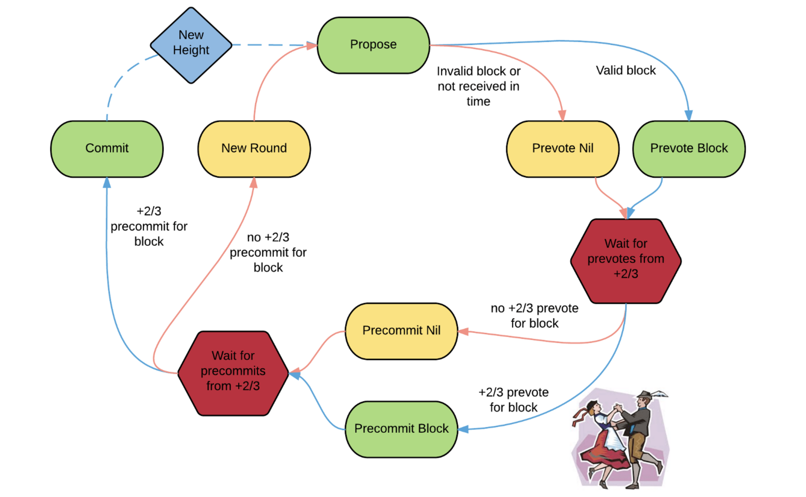
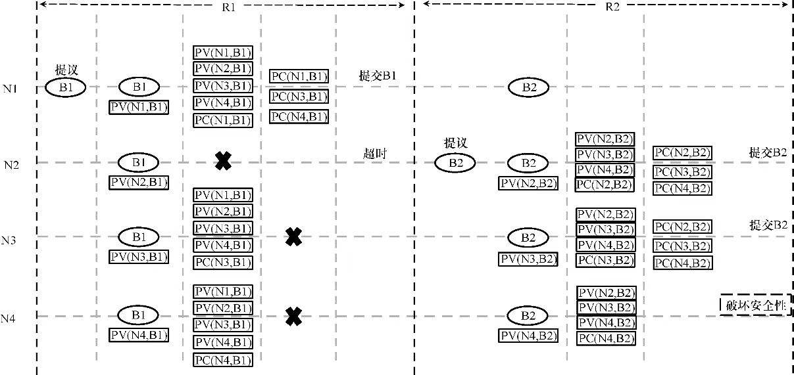
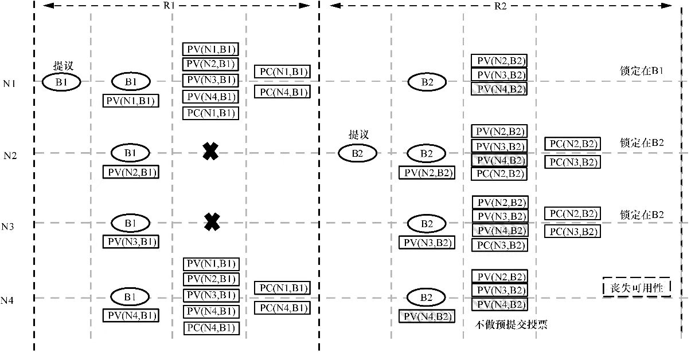
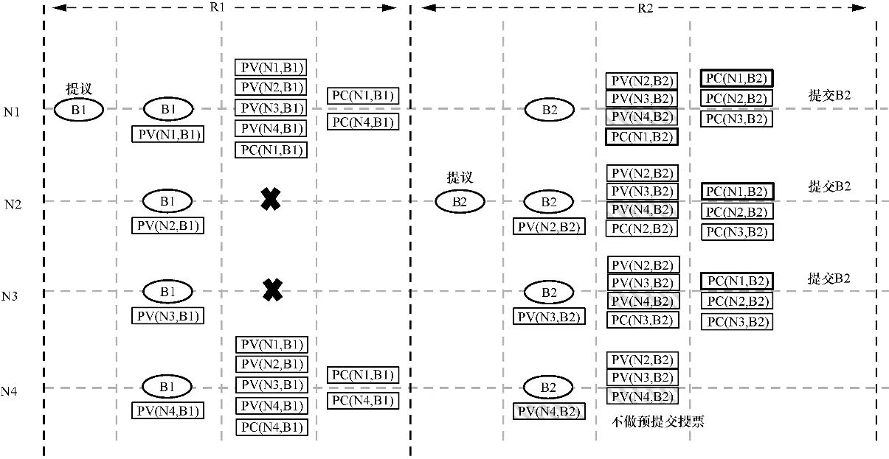
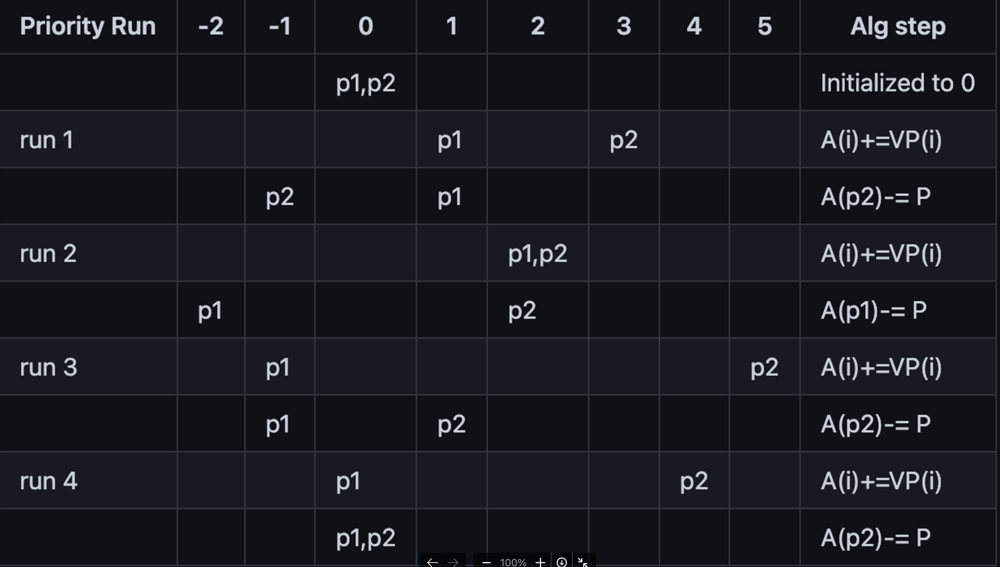

- [概述](#概述)
- [算法](#算法)
  - [算法概述](#算法概述)
  - [算法流程](#算法流程)
  - [锁定机制](#锁定机制)
  - [解锁机制](#解锁机制)
  - [提案者轮换选择算法](#提案者轮换选择算法)
- [代码实现](#代码实现)
  - [Reactor OnStart()](#reactor-onstart)
  - [State OnStart()](#state-onstart)
    - [ProposalMessage 消息处理](#proposalmessage-消息处理)
    - [BlockPartMessage 消息处理](#blockpartmessage-消息处理)
    - [Prevote 流程](#prevote-流程)
    - [Precommit 流程](#precommit-流程)
    - [Commit 流程](#commit-流程)
    - [VoteMessage 消息处理](#votemessage-消息处理)
    - [receiveRoutine](#receiveroutine)
  - [Reactor AddPeer()](#reactor-addpeer)
  - [Reactor Receive()](#reactor-receive)
- [参考资料](#参考资料)

# 概述
Tendermint 是一个基于拜占庭容错共识算法的区块链共识引擎，旨在提供高性能和去中心化的共识机制。Tendermint 的开发始于 2014 年，由 Jae Kwon 创立。该项目的目标是设计一个高性能且容错性强的共识算法，以用于区块链网络。2015年，Tendermint 团队开始发布一些关于共识和区块链的论文，其中最著名的是 "The ABCs of Consensus"。2016年，Tendermint 发布了第一个原型，引入了一种名为 "Tendermint Core" 的区块链共识引擎，该引擎采用 Byzantine Fault Tolerance（BFT）共识算法。这一年，Tendermint 被用于 Cosmos 网络的原型开发。后续随着Cosmos 的火爆以及模块化区块链概念的兴起，Tendermint共识算法被越来越多的应用以及公链项目所采用。

# 算法
## 算法概述

Tendermint是一个易于理解的、主要是异步操作的BFT共识协议。协议遵循一个简单的状态机，在每一个区块高度上, 基于多轮协议来决定下一个区块。协议的参与者称为validators（验证者），他们轮流提出区块并对其进行投票。 每一轮有三个步骤(提案(Propose), 预投票(Provote), 预提交(Precommit)), 以及两个特殊的步骤Commit和NewHeight 。所以在tendermint的区块打包始终是按着下面的顺序进行的:

```
NewHeight->(Propose -> Prevote -> Precommit)[一次区块确认可能需要多轮] -> Commit -> NewHeight
```

(Propose -> Prevote -> Precommit)被称为一轮。 所以说在tendermint中如果想要确认一个新的区块， 必须经历至少一轮这样的顺序。 一些情况下可能需要多轮才能决定出一个区块:

- 指定的提议者(指轮到其进行提案的验证者)不在线
- 被提议者提议的区块是无效的
- 被提议者提议的区块没有按时广播
- 提议的区块是有效的， 但是没有在规定时间内收到大于2/3个节点进行的预投票。
- 提议的区块是有效的， 但是没有在规定时间内收到大于2/3个节点进行的预提交。

>思考：为什么不能使用单阶段投票协议而是使用两阶段投票协议？
因为单阶段投票协议无法像两阶段投票协议一样，保证足够多的验证者知道第一次投票的结果，从而破坏系统的安全性。
>

## 算法流程

整体流程如下：



**通用的退出情况**

1. 超过2/3节点预提交投票在(H, R) 跳到Commit(H, R) --- 表示在本轮已经收到了2/3的节点预投票，那么直接可以进行Commit了
2. 超过2/3节点进行了预投票在(H, R+X) 跳到Prevote(H, R+x) --- 表示有更新的轮进入到了预投票阶段了
3. 超过2/3的预提交投票在(H, R+X) 跳到PreCommit(H, R+x) -- 表示更新的一轮已经进入到预提交阶段

**Propose Step(H, R)**

在每一轮开始前会通过 `round-robin` 方式选出一个 proposer，选出的 proposer 会提交这一轮的 proposal 广播到全网的对等网络节点。 根据下面几种情况进入下个步骤:

1. 提案超时，直接跳到PreVote(H, R)
2. 已经接收到提议的区块，并且此提案已经锁定(PoLC，后面会讲到) 跳到 PreVote(H, R)
3. 通用的退出情况

**Prevote Step (H, R)**

每一个验证者进入PreVote阶段时, 会广播自己的预投票。 如果验证者目前处于锁定阶段， 而且现在有一个新的锁定出现， **并且新的锁定比之前的锁定轮数大并且小于当前轮， 那么此验证者解锁。**如果验证者处于锁定， 但是不满足上面的情况， 则会直接投票给当前锁定的区块。如果验证者不处于锁定阶段，并且当前提案的区块是有效的，则投票给此处收到的提议区块。 如果验证者不处于锁定阶段，并且当前提案的区块是无效的，则投票给nill。

预投票阶段根据下面几种情况进入下一个步骤:

1. 超过2/3的预投票为此提案区块或者nill，则进入PreCommit(H,R)阶段
2. 预投票超时，进入PreCommit(H,R)阶段 ---也就是说在规定时间没有收到超过2/3的预投票
3. 通用退出情况

**Precommit Step (height:H,round:R)**

在PreCommit阶段， 验证者广播预提交的选票: 如果验证者在此轮锁定了区块, 那么它就会进行预提交投票此区块，并且设置LastLockRound=R。如果验证者在此轮锁定了nill, 那么它会解锁并且预提交投票给nill。否则保持之前锁定不变, 投票nill。

根据情况进入下一个步骤:

1. 超过2/3的节点预提交为nill，进入Propose(H, R+1)
2. 规定时间没有收到足够多的预提交，进入Propose(H, R+1)
3. 通用退出情况


**Commit Step (height:H)**

设置CommitTime = now() 等待这个区块内容接收到， 进入NewHeight(H+1)

>**为什么不会分叉?**

如果小于1/3节点是拜占庭节点（如果大于等于1/3，那么共识就没法达成了）。当validator commit 了区块 B，那么表示有大于2/3的节点在 R 轮投了 precommit，**这表示至少有大于1/3节点（大于1/3节点哪儿来的呢？就是大于2/3减去小于1/3。为什么是这么算呢？有人说不是有大于2/3的节点投了 precommit ，那么这些人不都是诚实的节点吗？当然不是了，拜占庭节点的意思它工作随性，有时候正确有时候失败。假设这个时候所有的拜占庭节点正确的工作了，所以都算在在+2/3节点内，所以这么算了）被 lock在了 R'> R。**如果这个时候有针对同一区块高度的投票，那么由于这+1/3节点被 lock在了 R' 轮，**所以在R'轮不会有+2/3的节点投 prevote**，也就不会在同一高度达成一个新的共识区块，所以就不会分叉。所以 Tendermint 不分叉是基于它是 BFT 共识，然后加上 PoLC 共同完成。
>

## 锁定机制

前面已经提到了锁定机制，那么为什么会需要锁定机制呢？因为仅仅依靠两阶段提交无法在所有情况下保证系统的安全性。如下图所示，R1轮的提案者N1构造并广播新的区块B1，假定所有的节点对该区块进行预投票，并且除N2在预投票PV(N2, B1)之后发生网络错误之外，其他节点均收集到了足够的预投票。此时N1、N3、N4节点均遵循协议进行预提交投票，不巧的是投票之后N3和N4也由于网络错误而接收不到任何信息。此时N1由于收集到了足够的预提交投票便正式提交了区块B1。发生网络错误的N2、N3和N4节点，在超时之后进入新一轮的共识投票过程。假设此后没有再发生网络错误，则N2、N3和N4节点根据协议正式提交了区块B2，节点N1由于已经正式在当前区块高度提交了区块B1，因此不会参与B2的共识投票过程。在该示例中可以看到仅仅由于网络错误问题就导致了两阶段投票协议无法保证系统的安全性。



(图3-1 锁定机制的缺失，无法保证 Tendermint 共识协议安全性)

Tendermint共识协议中引入了锁定（lock）机制来解决上述问题。根据两阶段投票协议，只有在收集到+2/3的预投票之后才可以进行预提交投票。锁定机制在此基础上添加了额外的约束：**当验证者节点对一个区块进行了预提交投票之后，该验证者节点必须锁定在该区块上。锁定意味着如果因为某种原因全网没有就该区块达成共识，则在该区块高度后续轮的共识投票过程中，该验证者的预投票必须投给自己当前锁定的区块。如果该验证者被选中成为新的提案者，也必须提交该区块。**Tendermint共识协议中用Prevote-the-Lock来指代这一规则。这条规则可以防止验证者在同一个区块高度的不同轮对不同的区块进行预投票。

在Prevote-the-Lock的规则下，重新考察上面的示例，看是否能够保证系统的安全性。如图3-2所示，假设在R1轮各个节点执行同样的操作并按照同样的顺序遭遇网络故障。进入R2轮之后，N2节点成为新的提案者，由于N2并没有锁定在区块B1，因此N2构建了新的区块B2，然而由于N3和N4在上一轮中已经锁定在区块B1，因此当收到区块B2时并不会对B2进行预投票，最终导致R2轮共识失败，从而启动新一轮R3的共识投票。此时N3成为新的提案者，根据Prevote-the-Lock规则，N3提议自己锁定的B1区块作为本轮的区块，假设两阶段投票协议和Prevote-the-Lock规则正常执行，最终4个节点都会提交区块B1。


(图3-2 采用Prevote-the-Lock规则，保证 Tendermint 共识协议安全性)

## 解锁机制

仅有锁定机制而没有解锁机制的Tendermint共识协议会发生**死锁**。考察图4-1所示的情形，R1轮中N2和N3两个节点在对区块B1进行预投票之后发生网络错误，而N1和N4节点收集到了所有的预投票，因此对区块B1执行了预提交投票并根据锁定规则锁定在区块B1。由于无法收集到+2/3的预提交投票，本轮的共识最终失败。开启新一轮共识投票过程，此时N2被选中为提案者并构建广播区块B2。假设此时N2和N3的网络通信恢复正常，并且只有N4为**拜占庭故障节点**。在收到区块B2后N1由于已经锁定在区块B1，因此不会对B2进行预投票。而锁定在B1的N4节点此时违背锁定机制对B2区块进行了预投票。这导致诚实节点N2和N3锁定在区块B2。此时3个诚实节点锁定在不同的区块上，此后诚实节点之间无法达成任何新的共识，也就破坏了系统的可用性。



(图4-1 解锁机制缺失，无法保证 Tendermint 共识协议可用性)

为了解决上述问题，Tendermint共识协议引入了解锁规则Unlock-on-Polka。**Tendermint共识协议称来自+2/3的验证者对区块的预投票为polka，而称来自+2/3的验证者对空值的预投票为nil-polka。Unlock-on-Polka规则约定：验证者在看到一个具有更高轮数的polka时可以从自己当前锁定的区块解锁。**引入这一规则之后，重新考虑上述情形，节点N1在R2轮看到关于区块B2的polka时，可以从区块B1解锁，并参与区块B2的共识投票，参见图4-2所示的示例。通过这种方式就能够避免前文的死锁问题，保证系统的可用性。



(图4-2 采用Unlock-on-Polka规则，保证Tendermint共识协议可用性)

综合考虑锁定和解锁两条规则，可以认为在每个新的区块高度刚开始时，所有的验证者节点已经锁定在空值。当验证者节点看到关于一个区块的polka时（锁定在空值时可以提议新区块或者对新区块投票），便从空值解锁并锁定到新的区块上。当发生验证者节点锁定的区块与后续轮中其他验证者都赞同的区块不一致的情况时，解锁机制允许验证者节点从锁定的区块释放并重新参与共识投票过程，两阶段投票协议配合锁定与解锁机制一同保证了基于Tendermint共识协议构建的分布式系统的**安全性和可用性**。

## 提案者轮换选择算法
Tendermint共识协议在每轮都会重新选择提案者，通过采用轮换选择算法（round-robin algorithm）保证验证者集合中的每个验证者都有机会被选中。由于每个验证者的投票权重有高有低，因此在采用轮换选择算法选取提案者时，需要保证每个验证者被选中的概率与其投票权重成正比。

上面提到proposer是通过round-robin方式从Validator数据组选出来的，那么Validator数组中的Validator是以什么规则被选中的呢？proposer选择顺序与Validato votingPower(投票力)有关，谁的VotingPower大谁优先被选中为proposer。如果每一轮都选择votingPower最大的，那么会不会出现votingPower大的Validator会一直被选中，而其他votingPower小的Validator会一直没有机会称为proposer呢？为了解决这个问题 Tendermint 提供了一个votingPower更新算法，算法的规则如下：

- Validator的初始votingPower与其stake是相等的，stake是什么？之前提到过 Tendermint 的共识算法是POS+BFT，这里的stake就是POS算法的权重，类似于POW算法的算力，用来衡量一个节点的权重的。如果Validator A在创世块中的stake是1，那么它的votingPower也会被初始化为1
- 每一轮结束后都会对Validator的votingPower做一次更新
    - 如果一个Validator在当前轮中没有被选中为proposer，那么它的votingPower将增加，**增加的值为它初始的stake**，例如Validator A的初始化stake为1，如果A没有被选中为proposer，那么它的**votingPower=pre_votingPower+stake**。
    - 如果一个Validator在当前轮中被选中为proposer，那么它的votingPower将减少，**减少的值为所有 Validator 的 stake 之和**，例如：Validator 集合={A:1,B:2}，如果B被选中为proposer，那么B的**votingPower=pre_votingPower-(stake_a+stake_b) = 2-3 = -1**

**定义：**

- vset - 验证者集合
- n - 验证者数量
- VP(i) - 验证者 i 的投票权
- A(i) - 验证者 i 的累计优先级
- P - 集合中所有验证者的投票总权重
- avg - 所有验证者优先级的平均值
- prop - 提案者

选举伪代码如下：

```
def ProposerSelection (vset):

        // compute priorities and elect proposer
        for each validator i in vset:
            A(i) += VP(i)
        prop = max(A)
        A(prop) -= P
```

一个例子：Validator集合={p1:1,p2:3}，其选举的proposer流程如下：



# 代码实现

Tendermint共识算法相关的是tendermint/consensus目录，Tendermint 的代码相对有些复杂，需要读者熟悉算法的流程和熟悉Go的Channel等语法才好理解。

## Reactor OnStart()

节点启动的时候会启动共识的Reactor，Reactor启动的代码如下：

```
// consensus/reactor.go
// OnStart implements BaseService by subscribing to events, which later will be
// broadcasted to other peers and starting state if we're not in block sync.
func (conR *Reactor) OnStart() error {
	conR.Logger.Info("Reactor ", "waitSync", conR.WaitSync())

	// start routine that computes peer statistics for evaluating peer quality
  // 启动协程计算Peer以评估Peer质量
	go conR.peerStatsRoutine()

  // 订阅广播事件
	conR.subscribeToBroadcastEvents()

  // 更新RoundState状态的协程
	go conR.updateRoundStateRoutine()

	if !conR.WaitSync() {
    // 启动共识State服务
		err := conR.conS.Start()
		if err != nil {
			return err
		}
	}

	return nil
}
```

其中peerStatsRoutine 用于根据统计某个节点向本地节点发送的投票信息和块部分信息的次数来评价该节点是否是好节点。

```
// consensus/reactor.go
func (conR *Reactor) peerStatsRoutine() {
	for {
		if !conR.IsRunning() {
			conR.Logger.Info("Stopping peerStatsRoutine")
			return
		}

		select {
		case msg := <-conR.conS.statsMsgQueue:	// 包括投票信息和块部分信息
			// Get peer
			peer := conR.Switch.Peers().Get(msg.PeerID)
			if peer == nil {
				conR.Logger.Debug("Attempt to update stats for non-existent peer",
					"peer", msg.PeerID)
				continue
			}
			// Get peer state
			ps, ok := peer.Get(types.PeerStateKey).(*PeerState)
			if !ok {
				panic(fmt.Sprintf("Peer %v has no state", peer))
			}
			switch msg.Msg.(type) {
			case *VoteMessage:
				// 记录该peer进行投票的次数，满足votesToContributeToBecomeGoodPeer的数量即将其标记为好节点
				if numVotes := ps.RecordVote(); numVotes%votesToContributeToBecomeGoodPeer == 0 {
					conR.Switch.MarkPeerAsGood(peer)
				}
			case *BlockPartMessage:
				// 记录该节点传播block part的数量，满足blocksToContributeToBecomeGoodPeer的数量即将其标记为好节点
				if numParts := ps.RecordBlockPart(); numParts%blocksToContributeToBecomeGoodPeer == 0 {
					conR.Switch.MarkPeerAsGood(peer)
				}
			}
		case <-conR.conS.Quit():
			return

		case <-conR.Quit():
			return
		}
	}
}
```

回到`OnStart`方法的 updateRoundStateRoutine 方法会定时去共识State获取共识的最新RoundState 并将其更新到 Reactor 的cstypes.RoundState 字段中。

```
// consensus/reactor.go
func (conR *Reactor) updateRoundStateRoutine() {
	t := time.NewTicker(100 * time.Microsecond)
	defer t.Stop()
	for range t.C {
		if !conR.IsRunning() {
			return
		}
		rs := conR.conS.GetRoundState()
		conR.mtx.Lock()
		conR.rs = rs
		conR.mtx.Unlock()
	}
}
```

## State OnStart()

Reator中的核心字段是State ，State 的作用是处理一致性算法的执行，处理投票和提案，并在达成共识后，向链提交区块，并针对应用程序执行区块。内部状态机接收来自对等方、内部验证器和计时器的输入。接下来看看State 服务的启动过程：

```
// consensus/state.go
// OnStart loads the latest state via the WAL, and starts the timeout and
// receive routines.
func (cs *State) OnStart() error {
	// We may set the WAL in testing before calling Start, so only OpenWAL if its
	// still the nilWAL.
	if _, ok := cs.wal.(nilWAL); ok {
		if err := cs.loadWalFile(); err != nil {
			return err
		}
	}

	// we need the timeoutRoutine for replay so
	// we don't block on the tick chan.
	// NOTE: we will get a build up of garbage go routines
	// firing on the tockChan until the receiveRoutine is started
	// to deal with them (by that point, at most one will be valid)
	if err := cs.timeoutTicker.Start(); err != nil {
		return err
	}

	// We may have lost some votes if the process crashed reload from consensus
	// log to catchup.
	if cs.doWALCatchup {
		repairAttempted := false

	LOOP:
		for {
			// 追赶重播
			err := cs.catchupReplay(cs.Height)
			switch {
			case err == nil:
				break LOOP

			case !IsDataCorruptionError(err):
				cs.Logger.Error("error on catchup replay; proceeding to start state anyway", "err", err)
				break LOOP

			case repairAttempted:
				return err
			}

			cs.Logger.Error("the WAL file is corrupted; attempting repair", "err", err)

			// 1) prep work
			if err := cs.wal.Stop(); err != nil {
				return err
			}

			repairAttempted = true

			// 2) backup original WAL file
			corruptedFile := fmt.Sprintf("%s.CORRUPTED", cs.config.WalFile())
			if err := tmos.CopyFile(cs.config.WalFile(), corruptedFile); err != nil {
				return err
			}

			cs.Logger.Debug("backed up WAL file", "src", cs.config.WalFile(), "dst", corruptedFile)

			// 3) try to repair (WAL file will be overwritten!)
			if err := repairWalFile(corruptedFile, cs.config.WalFile()); err != nil {
				cs.Logger.Error("the WAL repair failed", "err", err)
				return err
			}

			cs.Logger.Info("successful WAL repair")

			// reload WAL file
			if err := cs.loadWalFile(); err != nil {
				return err
			}
		}
	}

	if err := cs.evsw.Start(); err != nil {
		return err
	}

	// Double Signing Risk Reduction
	if err := cs.checkDoubleSigningRisk(cs.Height); err != nil {
		return err
	}

	// now start the receiveRoutine
	go cs.receiveRoutine(0)

	// schedule the first round!
	// use GetRoundState so we don't race the receiveRoutine for access
	cs.scheduleRound0(cs.GetRoundState())

	return nil
}
```

来看catchupReplay 方法，它会重播从上一个区块开始的消息：

```

// Replay only those messages since the last block.  `timeoutRoutine` should
// run concurrently to read off tickChan.
func (cs *State) catchupReplay(csHeight int64) error {

	// Set replayMode to true so we don't log signing errors.
	cs.replayMode = true
	defer func() { cs.replayMode = false }()

	// Ensure that #ENDHEIGHT for this height doesn't exist.
	// NOTE: This is just a sanity check. As far as we know things work fine
	// without it, and Handshake could reuse State if it weren't for
	// this check (since we can crash after writing #ENDHEIGHT).
	//
	// Ignore data corruption errors since this is a sanity check.
  // 从WAL中查找，WAL不应该包含最新高度的数据
	gr, found, err := cs.wal.SearchForEndHeight(csHeight, &WALSearchOptions{IgnoreDataCorruptionErrors: true})
	if err != nil {
		return err
	}
	if gr != nil {
		if err := gr.Close(); err != nil {
			return err
		}
	}
	if found {
		return fmt.Errorf("wal should not contain #ENDHEIGHT %d", csHeight)
	}

	// Search for last height marker.
	//
	// Ignore data corruption errors in previous heights because we only care about last height
  // 最新高度不应该小于初始的高度
	if csHeight < cs.state.InitialHeight {
		return fmt.Errorf("cannot replay height %v, below initial height %v", csHeight, cs.state.InitialHeight)
	}
	endHeight := csHeight - 1 // 之前结束的高度
	if csHeight == cs.state.InitialHeight {
		endHeight = 0
	}
  // 获取之前结束的高度的信息
	gr, found, err = cs.wal.SearchForEndHeight(endHeight, &WALSearchOptions{IgnoreDataCorruptionErrors: true})
	if err == io.EOF {
		cs.Logger.Error("Replay: wal.group.Search returned EOF", "#ENDHEIGHT", endHeight)
	} else if err != nil {
		return err
	}
	if !found {
		return fmt.Errorf("cannot replay height %d. WAL does not contain #ENDHEIGHT for %d", csHeight, endHeight)
	}
	defer gr.Close()

	cs.Logger.Info("Catchup by replaying consensus messages", "height", csHeight)

	var msg *TimedWALMessage
	dec := WALDecoder{gr}

LOOP:
	for {
		msg, err = dec.Decode()
		switch {
		case err == io.EOF:
			break LOOP
		case IsDataCorruptionError(err):
			cs.Logger.Error("data has been corrupted in last height of consensus WAL", "err", err, "height", csHeight)
			return err
		case err != nil:
			return err
		}

		// NOTE: since the priv key is set when the msgs are received
		// it will attempt to eg double sign but we can just ignore it
		// since the votes will be replayed and we'll get to the next step
    // 读取重播消息
		if err := cs.readReplayMessage(msg, nil); err != nil {
			return err
		}
	}
	cs.Logger.Info("Replay: Done")
	return nil
}
```

接下来看readReplayMessage 方法将重播消息应用到共识状态中：

```
// consensus/state.go
// 解码并将单个消息应用于共识状态，就像它是在receiveRoutine中接收的一样
// Unmarshal and apply a single message to the consensus state as if it were
// received in receiveRoutine.  Lines that start with "#" are ignored.
// NOTE: receiveRoutine should not be running.
func (cs *State) readReplayMessage(msg *TimedWALMessage, newStepSub types.Subscription) error {
	// Skip meta messages which exist for demarcating boundaries.
	if _, ok := msg.Msg.(EndHeightMessage); ok {
		return nil
	}

	// for logging
	switch m := msg.Msg.(type) {
	case types.EventDataRoundState: // Round事件消息
		cs.Logger.Info("Replay: New Step", "height", m.Height, "round", m.Round, "step", m.Step)
		// these are playback checks
		ticker := time.After(time.Second * 2)
		if newStepSub != nil {
			select {
			case stepMsg := <-newStepSub.Out():
				m2 := stepMsg.Data().(types.EventDataRoundState)
        // 判断Round事件消息和获取到的Round订阅消息是否匹配
				if m.Height != m2.Height || m.Round != m2.Round || m.Step != m2.Step {
					return fmt.Errorf("roundState mismatch. Got %v; Expected %v", m2, m)
				}
			case <-newStepSub.Cancelled():
				return fmt.Errorf("failed to read off newStepSub.Out(). newStepSub was canceled")
			case <-ticker:
				return fmt.Errorf("failed to read off newStepSub.Out()")
			}
		}
	case msgInfo:
		peerID := m.PeerID
		if peerID == "" {
			peerID = "local"
		}
		switch msg := m.Msg.(type) {
		case *ProposalMessage:
			p := msg.Proposal
			cs.Logger.Info("Replay: Proposal", "height", p.Height, "round", p.Round, "header",
				p.BlockID.PartSetHeader, "pol", p.POLRound, "peer", peerID)
		case *BlockPartMessage:
			cs.Logger.Info("Replay: BlockPart", "height", msg.Height, "round", msg.Round, "peer", peerID)
		case *VoteMessage:
			v := msg.Vote
			cs.Logger.Info("Replay: Vote", "height", v.Height, "round", v.Round, "type", v.Type,
				"blockID", v.BlockID, "peer", peerID)
		}
    // 处理消息
		cs.handleMsg(m)
	case timeoutInfo:
		cs.Logger.Info("Replay: Timeout", "height", m.Height, "round", m.Round, "step", m.Step, "dur", m.Duration)
		cs.handleTimeout(m, cs.RoundState)
	default:
		return fmt.Errorf("replay: Unknown TimedWALMessage type: %v", reflect.TypeOf(msg.Msg))
	}
	return nil
}
```

最终使用handleMsg 来处理具体的消息：

```
// consensus/state.go
// state transitions on complete-proposal, 2/3-any, 2/3-one
func (cs *State) handleMsg(mi msgInfo) {
	cs.mtx.Lock()
	defer cs.mtx.Unlock()
	var (
		added bool
		err   error
	)

	msg, peerID := mi.Msg, mi.PeerID

	switch msg := msg.(type) {
	case *ProposalMessage:
		// will not cause transition.
		// once proposal is set, we can receive block parts
		err = cs.setProposal(msg.Proposal)

	case *BlockPartMessage:
		// if the proposal is complete, we'll enterPrevote or tryFinalizeCommit
		added, err = cs.addProposalBlockPart(msg, peerID)

		// We unlock here to yield to any routines that need to read the the RoundState.
		// Previously, this code held the lock from the point at which the final block
		// part was received until the block executed against the application.
		// This prevented the reactor from being able to retrieve the most updated
		// version of the RoundState. The reactor needs the updated RoundState to
		// gossip the now completed block.
		//
		// This code can be further improved by either always operating on a copy
		// of RoundState and only locking when switching out State's copy of
		// RoundState with the updated copy or by emitting RoundState events in
		// more places for routines depending on it to listen for.
		cs.mtx.Unlock()

		cs.mtx.Lock()
		if added && cs.ProposalBlockParts.IsComplete() {
			cs.handleCompleteProposal(msg.Height)
		}
		if added {
      // 把消息放到statsMsgQueue 队列中，peerStatsRoutine 后续会在peerStatsRoutine 方法中用于统计节点的好坏。
			cs.statsMsgQueue <- mi
		}

		if err != nil && msg.Round != cs.Round {
			cs.Logger.Debug(
				"received block part from wrong round",
				"height", cs.Height,
				"cs_round", cs.Round,
				"block_round", msg.Round,
			)
			err = nil
		}

	case *VoteMessage:
		// attempt to add the vote and dupeout the validator if its a duplicate signature
		// if the vote gives us a 2/3-any or 2/3-one, we transition
		added, err = cs.tryAddVote(msg.Vote, peerID)
		if added {
      // 把消息放到statsMsgQueue 队列中，peerStatsRoutine 后续会在peerStatsRoutine 方法中用于统计节点的好坏。
			cs.statsMsgQueue <- mi
		}

		// if err == ErrAddingVote {
		// TODO: punish peer
		// We probably don't want to stop the peer here. The vote does not
		// necessarily comes from a malicious peer but can be just broadcasted by
		// a typical peer.
		// https://github.com/tendermint/tendermint/issues/1281
		// }

		// NOTE: the vote is broadcast to peers by the reactor listening
		// for vote events

		// TODO: If rs.Height == vote.Height && rs.Round < vote.Round,
		// the peer is sending us CatchupCommit precommits.
		// We could make note of this and help filter in broadcastHasVoteMessage().

	default:
		cs.Logger.Error("unknown msg type", "type", fmt.Sprintf("%T", msg))
		return
	}

	if err != nil {
		cs.Logger.Error(
			"failed to process message",
			"height", cs.Height,
			"round", cs.Round,
			"peer", peerID,
			"msg_type", fmt.Sprintf("%T", msg),
			"err", err,
		)
	}
}
```

消息包含三种类型：`ProposalMessage`，`BlockPartMessage` 和 `VoteMessage` 。

 ### ProposalMessage 消息处理

先来看处理`ProposalMessage` 消息的流程，调用`setProposal` 方法来处理`ProposalMessage` 消息，`setProposal` 方法的实现如下：

```
func (cs *State) defaultSetProposal(proposal *types.Proposal) error {
	// Already have one
	// TODO: possibly catch double proposals
	if cs.Proposal != nil {
		return nil
	}

	// Does not apply
	if proposal.Height != cs.Height || proposal.Round != cs.Round {
		return nil
	}

	// Verify POLRound, which must be -1 or in range [0, proposal.Round).
	if proposal.POLRound < -1 ||
		(proposal.POLRound >= 0 && proposal.POLRound >= proposal.Round) {
		return ErrInvalidProposalPOLRound
	}

	p := proposal.ToProto()
	// Verify signature
	if !cs.Validators.GetProposer().PubKey.VerifySignature(
		types.ProposalSignBytes(cs.state.ChainID, p), proposal.Signature,
	) {
		return ErrInvalidProposalSignature
	}

	proposal.Signature = p.Signature
	cs.Proposal = proposal
	// We don't update cs.ProposalBlockParts if it is already set.
	// This happens if we're already in cstypes.RoundStepCommit or if there is a valid block in the current round.
	// TODO: We can check if Proposal is for a different block as this is a sign of misbehavior!
	if cs.ProposalBlockParts == nil {
		cs.ProposalBlockParts = types.NewPartSetFromHeader(proposal.BlockID.PartSetHeader)
	}

	cs.Logger.Info("received proposal", "proposal", proposal)
	return nil
}
```

defaultSetProposal 方法主要是对提案中的高度和签名等信息做一些检查之后，将其放入到State 的RoundState 结构的Proposal字段中去。

### BlockPartMessage 消息处理
接着看处理BlockPartMessage 消息，首先调用addProposalBlockPart 来处理消息，验证消息中的区块高度和Round等信息必须和共识State中的匹配，接着获取消息中携带的区块part，将其放到 RoundState的ProposalBlockParts中，如果某一个区块中的part收集完成之后，即可将其打包成区块，并将区块放入到ProposalBlock字段中。

```
// NOTE: block is not necessarily valid.
// Asynchronously triggers either enterPrevote (before we timeout of propose) or tryFinalizeCommit,
// once we have the full block.
func (cs *State) addProposalBlockPart(msg *BlockPartMessage, peerID p2p.ID) (added bool, err error) {
	height, round, part := msg.Height, msg.Round, msg.Part

	// Blocks might be reused, so round mismatch is OK
	if cs.Height != height {
		cs.Logger.Debug("received block part from wrong height", "height", height, "round", round)
		cs.metrics.BlockGossipPartsReceived.With("matches_current", "false").Add(1)
		return false, nil
	}

	// We're not expecting a block part.
	if cs.ProposalBlockParts == nil {
		cs.metrics.BlockGossipPartsReceived.With("matches_current", "false").Add(1)
		// NOTE: this can happen when we've gone to a higher round and
		// then receive parts from the previous round - not necessarily a bad peer.
		cs.Logger.Debug(
			"received a block part when we are not expecting any",
			"height", height,
			"round", round,
			"index", part.Index,
			"peer", peerID,
		)
		return false, nil
	}

	added, err = cs.ProposalBlockParts.AddPart(part)
	if err != nil {
		if errors.Is(err, types.ErrPartSetInvalidProof) || errors.Is(err, types.ErrPartSetUnexpectedIndex) {
			cs.metrics.BlockGossipPartsReceived.With("matches_current", "false").Add(1)
		}
		return added, err
	}

	cs.metrics.BlockGossipPartsReceived.With("matches_current", "true").Add(1)

	if cs.ProposalBlockParts.ByteSize() > cs.state.ConsensusParams.Block.MaxBytes {
		return added, fmt.Errorf("total size of proposal block parts exceeds maximum block bytes (%d > %d)",
			cs.ProposalBlockParts.ByteSize(), cs.state.ConsensusParams.Block.MaxBytes,
		)
	}
	if added && cs.ProposalBlockParts.IsComplete() { // 如果区块中的part收集完成之后，即可将其打包成区块
		bz, err := io.ReadAll(cs.ProposalBlockParts.GetReader())
		if err != nil {
			return added, err
		}

		var pbb = new(tmproto.Block)
		err = proto.Unmarshal(bz, pbb)
		if err != nil {
			return added, err
		}
    // 打包成区块
		block, err := types.BlockFromProto(pbb)
		if err != nil {
			return added, err
		}

		cs.ProposalBlock = block

		// NOTE: it's possible to receive complete proposal blocks for future rounds without having the proposal
		cs.Logger.Info("received complete proposal block", "height", cs.ProposalBlock.Height, "hash", cs.ProposalBlock.Hash())

		if err := cs.eventBus.PublishEventCompleteProposal(cs.CompleteProposalEvent()); err != nil {
			cs.Logger.Error("failed publishing event complete proposal", "err", err)
		}
	}
	return added, nil
}
```

回到 handleMsg 函数中处理BlockPartMessage 的分支流程，cs.ProposalBlockParts.IsComplete() 判断是否收集完区块的part，如果收集完成之后调用handleCompleteProposal 方法，该方法会首先判断是不是超过2/3的与投票，如果超过且区块有效则更新共识State中RoundState的相关字段信息。接着再判断了共识当前所处的阶段，根据当前所处的阶段进入一下一个阶段。

```
func (cs *State) handleCompleteProposal(blockHeight int64) {
	// Update Valid* if we can.
	prevotes := cs.Votes.Prevotes(cs.Round) // 获取该轮的预投票集合
	blockID, hasTwoThirds := prevotes.TwoThirdsMajority() // 查询是否超过2/3的投票
	// 如果对于该轮超过2/3的投票且最新的POLRound < Round
	if hasTwoThirds && !blockID.IsZero() && (cs.ValidRound < cs.Round) {
		if cs.ProposalBlock.HashesTo(blockID.Hash) { // 验证区块的hash值是否正确
			cs.Logger.Debug(
				"updating valid block to new proposal block",
				"valid_round", cs.Round,
				"valid_block_hash", log.NewLazyBlockHash(cs.ProposalBlock),
			)
      // 更新POLRound，ValidBlock， ValidBlockParts信息
			cs.ValidRound = cs.Round
			cs.ValidBlock = cs.ProposalBlock
			cs.ValidBlockParts = cs.ProposalBlockParts
		}
		// TODO: In case there is +2/3 majority in Prevotes set for some
		// block and cs.ProposalBlock contains different block, either
		// proposer is faulty or voting power of faulty processes is more
		// than 1/3. We should trigger in the future accountability
		// procedure at this point.
	}

	if cs.Step <= cstypes.RoundStepPropose && cs.isProposalComplete() {
		// Move onto the next step
		// 开启预投票流程
		cs.enterPrevote(blockHeight, cs.Round)
		if hasTwoThirds { // this is optimisation as this will be triggered when prevote is added
      // 开启预提交流程
			cs.enterPrecommit(blockHeight, cs.Round)
		}
	} else if cs.Step == cstypes.RoundStepCommit {
		// 开启提交流程
		// If we're waiting on the proposal block...
		cs.tryFinalizeCommit(blockHeight)
	}
}
```

### Prevote 流程
如果当前的`Step≤RoundStepPropose`且满足*`cs*.isProposalComplete()` ，则开启预投票的流程，*`cs*.isProposalComplete()` 实际上就是判断该提案是否满足了+2/3投票，或者之前锁定的`Proposal.POLRound` 获得了+2/3 的投票，预投票流程如下：

```
// Enter: `timeoutPropose` after entering Propose.
// Enter: proposal block and POL is ready.
// Prevote for LockedBlock if we're locked, or ProposalBlock if valid.
// Otherwise vote nil.
func (cs *State) enterPrevote(height int64, round int32) {
	logger := cs.Logger.With("height", height, "round", round)

	if cs.Height != height || round < cs.Round || (cs.Round == round && cstypes.RoundStepPrevote <= cs.Step) {
		logger.Debug(
			"entering prevote step with invalid args",
			"current", log.NewLazySprintf("%v/%v/%v", cs.Height, cs.Round, cs.Step),
		)
		return
	}

	defer func() {
		// Done enterPrevote:
		cs.updateRoundStep(round, cstypes.RoundStepPrevote)
		cs.newStep()
	}()

	logger.Debug("entering prevote step", "current", log.NewLazySprintf("%v/%v/%v", cs.Height, cs.Round, cs.Step))

	// Sign and broadcast vote as necessary
	cs.doPrevote(height, round)

	// Once `addVote` hits any +2/3 prevotes, we will go to PrevoteWait
	// (so we have more time to try and collect +2/3 prevotes for a single block)
}
```

可以看到预投票流程是先做一些基本信息的检查，然后调用了doPrevote 进行预投票：

```
func (cs *State) defaultDoPrevote(height int64, round int32) {
	logger := cs.Logger.With("height", height, "round", round)

	// If a block is locked, prevote that.
  // 如果之前锁定了一个区块，那么直接对该区块进行签名投票
	if cs.LockedBlock != nil {
		logger.Debug("prevote step; already locked on a block; prevoting locked block")
		cs.signAddVote(tmproto.PrevoteType, cs.LockedBlock.Hash(), cs.LockedBlockParts.Header())
		return
	}

	// If ProposalBlock is nil, prevote nil.
  // 如果提案区块为空，直接进行签名投票
	if cs.ProposalBlock == nil {
		logger.Debug("prevote step: ProposalBlock is nil")
		cs.signAddVote(tmproto.PrevoteType, nil, types.PartSetHeader{})
		return
	}

	// Validate proposal block, from Tendermint's perspective
  // 检查提案区块基本信息是否有效，如果无效则对nil进行投票
	err := cs.blockExec.ValidateBlock(cs.state, cs.ProposalBlock)
	if err != nil {
		// ProposalBlock is invalid, prevote nil.
		logger.Error("prevote step: consensus deems this block invalid; prevoting nil",
			"err", err)
		cs.signAddVote(tmproto.PrevoteType, nil, types.PartSetHeader{})
		return
	}

	/*
		Before prevoting on the block received from the proposer for the current round and height,
		we request the Application, via `ProcessProposal` ABCI call, to confirm that the block is
		valid. If the Application does not accept the block, Tendermint prevotes `nil`.

		WARNING: misuse of block rejection by the Application can seriously compromise Tendermint's
		liveness properties. Please see `PrepareProosal`-`ProcessProposal` coherence and determinism
		properties in the ABCI++ specification.
	*/
  // 交由abci调用上层应用去确认区块是否有效，如果Application不接受该块，则对nil进行投票
	isAppValid, err := cs.blockExec.ProcessProposal(cs.ProposalBlock, cs.state)
	if err != nil {
		panic(fmt.Sprintf(
			"state machine returned an error (%v) when calling ProcessProposal", err,
		))
	}
	cs.metrics.MarkProposalProcessed(isAppValid)

	// Vote nil if the Application rejected the block
	if !isAppValid {
		logger.Error("prevote step: state machine rejected a proposed block; this should not happen:"+
			"the proposer may be misbehaving; prevoting nil", "err", err)
		cs.signAddVote(tmproto.PrevoteType, nil, types.PartSetHeader{})
		return
	}

	// Prevote cs.ProposalBlock
	// NOTE: the proposal signature is validated when it is received,
	// and the proposal block parts are validated as they are received (against the merkle hash in the proposal)
	logger.Debug("prevote step: ProposalBlock is valid")
	cs.signAddVote(tmproto.PrevoteType, cs.ProposalBlock.Hash(), cs.ProposalBlockParts.Header())
}

// sign the vote and publish on internalMsgQueue
func (cs *State) signAddVote(msgType tmproto.SignedMsgType, hash []byte, header types.PartSetHeader) *types.Vote {
	if cs.privValidator == nil { // the node does not have a key
		return nil
	}

	if cs.privValidatorPubKey == nil {
		// Vote won't be signed, but it's not critical.
		cs.Logger.Error(fmt.Sprintf("signAddVote: %v", errPubKeyIsNotSet))
		return nil
	}

	// If the node not in the validator set, do nothing.
	if !cs.Validators.HasAddress(cs.privValidatorPubKey.Address()) {
		return nil
	}

	// TODO: pass pubKey to signVote
	vote, err := cs.signVote(msgType, hash, header)
	if err == nil {
    // 放到State的internalMsgQueue中
		cs.sendInternalMessage(msgInfo{&VoteMessage{vote}, ""})
		cs.Logger.Debug("signed and pushed vote", "height", cs.Height, "round", cs.Round, "vote", vote)
		return vote
	}

	cs.Logger.Error("failed signing vote", "height", cs.Height, "round", cs.Round, "vote", vote, "err", err)
	return nil
}
```

### Precommit 流程
回到之前的流程，如果预投票之后hasTwoThirds判断为真，则进入Precommit流程：

```
// Enter: `timeoutPrevote` after any +2/3 prevotes.
// Enter: `timeoutPrecommit` after any +2/3 precommits.
// Enter: +2/3 precomits for block or nil.
// Lock & precommit the ProposalBlock if we have enough prevotes for it (a POL in this round)
// else, unlock an existing lock and precommit nil if +2/3 of prevotes were nil,
// else, precommit nil otherwise.
func (cs *State) enterPrecommit(height int64, round int32) {
	logger := cs.Logger.With("height", height, "round", round)

	if cs.Height != height || round < cs.Round || (cs.Round == round && cstypes.RoundStepPrecommit <= cs.Step) {
		logger.Debug(
			"entering precommit step with invalid args",
			"current", log.NewLazySprintf("%v/%v/%v", cs.Height, cs.Round, cs.Step),
		)
		return
	}

	logger.Debug("entering precommit step", "current", log.NewLazySprintf("%v/%v/%v", cs.Height, cs.Round, cs.Step))

	defer func() {
		// Done enterPrecommit:
		cs.updateRoundStep(round, cstypes.RoundStepPrecommit)
		cs.newStep()
	}()

	// check for a polka
	// 检查预投票满足+2/3
	blockID, ok := cs.Votes.Prevotes(round).TwoThirdsMajority()

	// If we don't have a polka, we must precommit nil.
	// 如果预投票不满足+2/3，则Precommit对nil投票
	if !ok {
		if cs.LockedBlock != nil {
			logger.Debug("precommit step; no +2/3 prevotes during enterPrecommit while we are locked; precommitting nil")
		} else {
			logger.Debug("precommit step; no +2/3 prevotes during enterPrecommit; precommitting nil")
		}

		cs.signAddVote(tmproto.PrecommitType, nil, types.PartSetHeader{})
		return
	}

	// At this point +2/3 prevoted for a particular block or nil.
	// 广播事件
	if err := cs.eventBus.PublishEventPolka(cs.RoundStateEvent()); err != nil {
		logger.Error("failed publishing polka", "err", err)
	}

	// the latest POLRound should be this round.
	// 最新的POLRound应该和当前的round相等
	polRound, _ := cs.Votes.POLInfo()
	if polRound < round {
		panic(fmt.Sprintf("this POLRound should be %v but got %v", round, polRound))
	}

	// +2/3 prevoted nil. Unlock and precommit nil.
	if len(blockID.Hash) == 0 {
		if cs.LockedBlock == nil {
			logger.Debug("precommit step; +2/3 prevoted for nil")
		} else {
			logger.Debug("precommit step; +2/3 prevoted for nil; unlocking")
			cs.LockedRound = -1
			cs.LockedBlock = nil
			cs.LockedBlockParts = nil

			if err := cs.eventBus.PublishEventUnlock(cs.RoundStateEvent()); err != nil {
				logger.Error("failed publishing event unlock", "err", err)
			}
		}

		cs.signAddVote(tmproto.PrecommitType, nil, types.PartSetHeader{})
		return
	}

	// At this point, +2/3 prevoted for a particular block.

	// If we're already locked on that block, precommit it, and update the LockedRound
	// 如果我们已经锁定在该区块，则对锁定的区块进行预提交投票，并更新LockedRound为当前round
	if cs.LockedBlock.HashesTo(blockID.Hash) {
		logger.Debug("precommit step; +2/3 prevoted locked block; relocking")
		cs.LockedRound = round

		if err := cs.eventBus.PublishEventRelock(cs.RoundStateEvent()); err != nil {
			logger.Error("failed publishing event relock", "err", err)
		}

		cs.signAddVote(tmproto.PrecommitType, blockID.Hash, blockID.PartSetHeader)
		return
	}

	// If +2/3 prevoted for proposal block, stage and precommit it
	// 如果当前提案的区块获取的+2/3的预投票，则对该区块进行预提交投票
	if cs.ProposalBlock.HashesTo(blockID.Hash) {
		logger.Debug("precommit step; +2/3 prevoted proposal block; locking", "hash", blockID.Hash)

		// Validate the block.
		if err := cs.blockExec.ValidateBlock(cs.state, cs.ProposalBlock); err != nil {
			panic(fmt.Sprintf("precommit step; +2/3 prevoted for an invalid block: %v", err))
		}
		// 将区块和Round锁定在当前的区块和Round
		cs.LockedRound = round
		cs.LockedBlock = cs.ProposalBlock
		cs.LockedBlockParts = cs.ProposalBlockParts

		if err := cs.eventBus.PublishEventLock(cs.RoundStateEvent()); err != nil {
			logger.Error("failed publishing event lock", "err", err)
		}

		cs.signAddVote(tmproto.PrecommitType, blockID.Hash, blockID.PartSetHeader)
		return
	}

	// There was a polka in this round for a block we don't have.
	// Fetch that block, unlock, and precommit nil.
	// The +2/3 prevotes for this round is the POL for our unlock.
	logger.Debug("precommit step; +2/3 prevotes for a block we do not have; voting nil", "block_id", blockID)
	// 如果没有获取到 +2/3 的预投票，则将LockedRound更新为-1，LockedBlock更新为空
	cs.LockedRound = -1
	cs.LockedBlock = nil
	cs.LockedBlockParts = nil

	if !cs.ProposalBlockParts.HasHeader(blockID.PartSetHeader) {
		cs.ProposalBlock = nil
		cs.ProposalBlockParts = types.NewPartSetFromHeader(blockID.PartSetHeader)
	}

	if err := cs.eventBus.PublishEventUnlock(cs.RoundStateEvent()); err != nil {
		logger.Error("failed publishing event unlock", "err", err)
	}

	cs.signAddVote(tmproto.PrecommitType, nil, types.PartSetHeader{})
}
```

### Commit 流程
如果+2/3预投票通过，则进入commit流程，主要通过abci调用上层应用执行区块交易，将交易状态变更更新到数据库，更新新一轮的共识状态。

```
// Enter: +2/3 precommits for block
func (cs *State) enterCommit(height int64, commitRound int32) {
	logger := cs.Logger.With("height", height, "commit_round", commitRound)

	if cs.Height != height || cstypes.RoundStepCommit <= cs.Step {
		logger.Debug(
			"entering commit step with invalid args",
			"current", log.NewLazySprintf("%v/%v/%v", cs.Height, cs.Round, cs.Step),
		)
		return
	}

	logger.Debug("entering commit step", "current", log.NewLazySprintf("%v/%v/%v", cs.Height, cs.Round, cs.Step))

	defer func() {
		// Done enterCommit:
		// keep cs.Round the same, commitRound points to the right Precommits set.
		cs.updateRoundStep(cs.Round, cstypes.RoundStepCommit)
		cs.CommitRound = commitRound
		cs.CommitTime = tmtime.Now()
		cs.newStep()

		// Maybe finalize immediately.
		cs.tryFinalizeCommit(height)
	}()

	blockID, ok := cs.Votes.Precommits(commitRound).TwoThirdsMajority()
	if !ok {
		panic("RunActionCommit() expects +2/3 precommits")
	}

	// The Locked* fields no longer matter.
	// Move them over to ProposalBlock if they match the commit hash,
	// otherwise they'll be cleared in updateToState.
	if cs.LockedBlock.HashesTo(blockID.Hash) {
		logger.Debug("commit is for a locked block; set ProposalBlock=LockedBlock", "block_hash", blockID.Hash)
		cs.ProposalBlock = cs.LockedBlock
		cs.ProposalBlockParts = cs.LockedBlockParts
	}

	// If we don't have the block being committed, set up to get it.
	if !cs.ProposalBlock.HashesTo(blockID.Hash) {
		if !cs.ProposalBlockParts.HasHeader(blockID.PartSetHeader) {
			logger.Info(
				"commit is for a block we do not know about; set ProposalBlock=nil",
				"proposal", log.NewLazyBlockHash(cs.ProposalBlock),
				"commit", blockID.Hash,
			)

			// We're getting the wrong block.
			// Set up ProposalBlockParts and keep waiting.
			cs.ProposalBlock = nil
			cs.ProposalBlockParts = types.NewPartSetFromHeader(blockID.PartSetHeader)

			if err := cs.eventBus.PublishEventValidBlock(cs.RoundStateEvent()); err != nil {
				logger.Error("failed publishing valid block", "err", err)
			}

			cs.evsw.FireEvent(types.EventValidBlock, &cs.RoundState)
		}
	}
}

// Increment height and goto cstypes.RoundStepNewHeight
func (cs *State) finalizeCommit(height int64) {
	logger := cs.Logger.With("height", height)

	if cs.Height != height || cs.Step != cstypes.RoundStepCommit {
		logger.Debug(
			"entering finalize commit step",
			"current", log.NewLazySprintf("%v/%v/%v", cs.Height, cs.Round, cs.Step),
		)
		return
	}

	cs.calculatePrevoteMessageDelayMetrics()

	blockID, ok := cs.Votes.Precommits(cs.CommitRound).TwoThirdsMajority()
	block, blockParts := cs.ProposalBlock, cs.ProposalBlockParts

	if !ok {
		panic("cannot finalize commit; commit does not have 2/3 majority")
	}
	if !blockParts.HasHeader(blockID.PartSetHeader) {
		panic("expected ProposalBlockParts header to be commit header")
	}
	if !block.HashesTo(blockID.Hash) {
		panic("cannot finalize commit; proposal block does not hash to commit hash")
	}

	if err := cs.blockExec.ValidateBlock(cs.state, block); err != nil {
		panic(fmt.Errorf("+2/3 committed an invalid block: %w", err))
	}

	logger.Info(
		"finalizing commit of block",
		"hash", log.NewLazyBlockHash(block),
		"root", block.AppHash,
		"num_txs", len(block.Txs),
	)
	logger.Debug("committed block", "block", log.NewLazySprintf("%v", block))

	fail.Fail() // XXX

	// Save to blockStore.
	if cs.blockStore.Height() < block.Height {
		// NOTE: the seenCommit is local justification to commit this block,
		// but may differ from the LastCommit included in the next block
		precommits := cs.Votes.Precommits(cs.CommitRound)
		seenCommit := precommits.MakeCommit()
		cs.blockStore.SaveBlock(block, blockParts, seenCommit)
	} else {
		// Happens during replay if we already saved the block but didn't commit
		logger.Debug("calling finalizeCommit on already stored block", "height", block.Height)
	}

	fail.Fail() // XXX

	// Write EndHeightMessage{} for this height, implying that the blockstore
	// has saved the block.
	//
	// If we crash before writing this EndHeightMessage{}, we will recover by
	// running ApplyBlock during the ABCI handshake when we restart.  If we
	// didn't save the block to the blockstore before writing
	// EndHeightMessage{}, we'd have to change WAL replay -- currently it
	// complains about replaying for heights where an #ENDHEIGHT entry already
	// exists.
	//
	// Either way, the State should not be resumed until we
	// successfully call ApplyBlock (ie. later here, or in Handshake after
	// restart).
	endMsg := EndHeightMessage{height}
	if err := cs.wal.WriteSync(endMsg); err != nil { // NOTE: fsync
		panic(fmt.Sprintf(
			"failed to write %v msg to consensus WAL due to %v; check your file system and restart the node",
			endMsg, err,
		))
	}

	fail.Fail() // XXX

	// Create a copy of the state for staging and an event cache for txs.
	stateCopy := cs.state.Copy()

	// Execute and commit the block, update and save the state, and update the mempool.
	// NOTE The block.AppHash wont reflect these txs until the next block.
	stateCopy, err := cs.blockExec.ApplyBlock(
		stateCopy,
		types.BlockID{
			Hash:          block.Hash(),
			PartSetHeader: blockParts.Header(),
		},
		block,
	)
	if err != nil {
		logger.Error("failed to apply block", "err", err)
		return
	}

	fail.Fail() // XXX

	// must be called before we update state
	cs.recordMetrics(height, block)

	// NewHeightStep!
	cs.updateToState(stateCopy)

	fail.Fail() // XXX

	// Private validator might have changed it's key pair => refetch pubkey.
	if err := cs.updatePrivValidatorPubKey(); err != nil {
		logger.Error("failed to get private validator pubkey", "err", err)
	}

	// cs.StartTime is already set.
	// Schedule Round0 to start soon.
	cs.scheduleRound0(&cs.RoundState)

	// By here,
	// * cs.Height has been increment to height+1
	// * cs.Step is now cstypes.RoundStepNewHeight
	// * cs.StartTime is set to when we will start round0.
}
```

### VoteMessage 消息处理
回到处理最后一种消息VoteMessage，tryAddVote 会将投票信息添加到RoundState的投票集合中，如果投票集合满足+2/3的话就会进入一下个阶段。如果成功添加了投票信息之后，就把消息放到statsMsgQueue 队列中，peerStatsRoutine 后续会在peerStatsRoutine 方法中用于统计节点的好坏。

```
// consensus/state.go(handleMsg)
case *VoteMessage:
		// attempt to add the vote and dupeout the validator if its a duplicate signature
		// if the vote gives us a 2/3-any or 2/3-one, we transition
		added, err = cs.tryAddVote(msg.Vote, peerID)
		if added {
			cs.statsMsgQueue <- mi
		}
```

### receiveRoutine

回到State的启动步骤，最后调用了receiveRoutine 协程来处理节点和内部队列中的消息。internalMsgQueue 主要用来处理共识内部的消息，消息类型有：VoteMessage ，ProposalMessage ，BlockPartMessage。peerMsgQueue 接受来自其他节点的消息，包括：ProposalMessage，BlockPartMessage，VoteMessage，且其主要来源是Reactor的Receive()。两种队列的消息处理方式是一样的，最终都会调用handleMsg来处理消息。

```
//-----------------------------------------
// the main go routines

// receiveRoutine handles messages which may cause state transitions.
// it's argument (n) is the number of messages to process before exiting - use 0 to run forever
// It keeps the RoundState and is the only thing that updates it.
// Updates (state transitions) happen on timeouts, complete proposals, and 2/3 majorities.
// State must be locked before any internal state is updated.
func (cs *State) receiveRoutine(maxSteps int) {
	onExit := func(cs *State) {
		// NOTE: the internalMsgQueue may have signed messages from our
		// priv_val that haven't hit the WAL, but its ok because
		// priv_val tracks LastSig

		// close wal now that we're done writing to it
		if err := cs.wal.Stop(); err != nil {
			cs.Logger.Error("failed trying to stop WAL", "error", err)
		}

		cs.wal.Wait()
		close(cs.done)
	}

	defer func() {
		if r := recover(); r != nil {
			cs.Logger.Error("CONSENSUS FAILURE!!!", "err", r, "stack", string(debug.Stack()))
			// stop gracefully
			//
			// NOTE: We most probably shouldn't be running any further when there is
			// some unexpected panic. Some unknown error happened, and so we don't
			// know if that will result in the validator signing an invalid thing. It
			// might be worthwhile to explore a mechanism for manual resuming via
			// some console or secure RPC system, but for now, halting the chain upon
			// unexpected consensus bugs sounds like the better option.
			onExit(cs)
		}
	}()

	for {
		if maxSteps > 0 {
			if cs.nSteps >= maxSteps {
				cs.Logger.Debug("reached max steps; exiting receive routine")
				cs.nSteps = 0
				return
			}
		}

		rs := cs.RoundState
		var mi msgInfo

		select {
		case <-cs.txNotifier.TxsAvailable():
			cs.handleTxsAvailable()

		case mi = <-cs.peerMsgQueue: // 
			if err := cs.wal.Write(mi); err != nil {
				cs.Logger.Error("failed writing to WAL", "err", err)
			}

			// handles proposals, block parts, votes
			// may generate internal events (votes, complete proposals, 2/3 majorities)
			cs.handleMsg(mi)

		case mi = <-cs.internalMsgQueue: // 内部队列消息，可能从共识的各个阶段传过来的
			err := cs.wal.WriteSync(mi) // NOTE: fsync
			if err != nil {
				panic(fmt.Sprintf(
					"failed to write %v msg to consensus WAL due to %v; check your file system and restart the node",
					mi, err,
				))
			}

			if _, ok := mi.Msg.(*VoteMessage); ok {
				// we actually want to simulate failing during
				// the previous WriteSync, but this isn't easy to do.
				// Equivalent would be to fail here and manually remove
				// some bytes from the end of the wal.
				fail.Fail() // XXX
			}

			// handles proposals, block parts, votes
			cs.handleMsg(mi)

		case ti := <-cs.timeoutTicker.Chan(): // tockChan:
			if err := cs.wal.Write(ti); err != nil {
				cs.Logger.Error("failed writing to WAL", "err", err)
			}

			// if the timeout is relevant to the rs
			// go to the next step
			cs.handleTimeout(ti, rs)

		case <-cs.Quit():
			onExit(cs)
			return
		}
	}
}
```

## Reactor AddPeer()

AddPeer()方法会在Switch调用addPeer()方法的时候调用，其主要作用是和其他节点进行Gossip连接，向其他节点发送同步投票等信息。

```
// consensus/reactor.go
// AddPeer implements Reactor by spawning multiple gossiping goroutines for the
// peer.
func (conR *Reactor) AddPeer(peer p2p.Peer) {
	if !conR.IsRunning() {
		return
	}

	peerState, ok := peer.Get(types.PeerStateKey).(*PeerState)
	if !ok {
		panic(fmt.Sprintf("peer %v has no state", peer))
	}
	// Begin routines for this peer.
	go conR.gossipDataRoutine(peer, peerState)
	go conR.gossipVotesRoutine(peer, peerState)
	go conR.queryMaj23Routine(peer, peerState)

	// Send our state to peer.
	// If we're block_syncing, broadcast a RoundStepMessage later upon SwitchToConsensus().
	if !conR.WaitSync() {
		conR.sendNewRoundStepMessage(peer)
	}
}
```

## Reactor Receive()
Receive()主要从MConnect那里接受从其他节点发送来的共识消息，消息Channel类型包括：StateChannel，DataChannel，VoteChannel，VoteSetBitsChannel，不同Channel类型的消息处理逻辑不同。如果是DataChannel和VoteChannel的消息，会放到共识State的peerMsgQueue 中等待后续State对消息进行处理。其他Channel的消息一般会将其维护到节点集合中对应节点的状态。

```
// consensus/reactor.go
// Receive implements Reactor
// NOTE: We process these messages even when we're block_syncing.
// Messages affect either a peer state or the consensus state.
// Peer state updates can happen in parallel, but processing of
// proposals, block parts, and votes are ordered by the receiveRoutine
// NOTE: blocks on consensus state for proposals, block parts, and votes
func (conR *Reactor) Receive(chID byte, src p2p.Peer, msgBytes []byte) {
	if !conR.IsRunning() {
		conR.Logger.Debug("Receive", "src", src, "chId", chID, "bytes", msgBytes)
		return
	}

	msg, err := decodeMsg(msgBytes)
	if err != nil {
		conR.Logger.Error("Error decoding message", "src", src, "chId", chID, "err", err)
		conR.Switch.StopPeerForError(src, err)
		return
	}

	if err = msg.ValidateBasic(); err != nil {
		conR.Logger.Error("Peer sent us invalid msg", "peer", src, "msg", msg, "err", err)
		conR.Switch.StopPeerForError(src, err)
		return
	}

	conR.Logger.Debug("Receive", "src", src, "chId", chID, "msg", msg)

	// Get peer states
	ps, ok := src.Get(types.PeerStateKey).(*PeerState)
	if !ok {
		panic(fmt.Sprintf("Peer %v has no state", src))
	}

	switch chID {
	case StateChannel:
		switch msg := msg.(type) {
		case *NewRoundStepMessage:
			conR.conS.mtx.Lock()
			initialHeight := conR.conS.state.InitialHeight
			conR.conS.mtx.Unlock()
			if err = msg.ValidateHeight(initialHeight); err != nil {
				conR.Logger.Error("Peer sent us invalid msg", "peer", src, "msg", msg, "err", err)
				conR.Switch.StopPeerForError(src, err)
				return
			}
			ps.ApplyNewRoundStepMessage(msg)
		case *NewValidBlockMessage:
			ps.ApplyNewValidBlockMessage(msg)
		case *HasVoteMessage:
			ps.ApplyHasVoteMessage(msg)
		case *VoteSetMaj23Message:
			cs := conR.conS
			cs.mtx.Lock()
			height, votes := cs.Height, cs.Votes
			cs.mtx.Unlock()
			if height != msg.Height {
				return
			}
			// Peer claims to have a maj23 for some BlockID at H,R,S,
			err := votes.SetPeerMaj23(msg.Round, msg.Type, ps.peer.ID(), msg.BlockID)
			if err != nil {
				conR.Switch.StopPeerForError(src, err)
				return
			}
			// Respond with a VoteSetBitsMessage showing which votes we have.
			// (and consequently shows which we don't have)
			var ourVotes *bits.BitArray
			switch msg.Type {
			case tmproto.PrevoteType:
				ourVotes = votes.Prevotes(msg.Round).BitArrayByBlockID(msg.BlockID)
			case tmproto.PrecommitType:
				ourVotes = votes.Precommits(msg.Round).BitArrayByBlockID(msg.BlockID)
			default:
				panic("Bad VoteSetBitsMessage field Type. Forgot to add a check in ValidateBasic?")
			}
			src.TrySend(VoteSetBitsChannel, MustEncode(&VoteSetBitsMessage{
				Height:  msg.Height,
				Round:   msg.Round,
				Type:    msg.Type,
				BlockID: msg.BlockID,
				Votes:   ourVotes,
			}))
		default:
			conR.Logger.Error(fmt.Sprintf("Unknown message type %v", reflect.TypeOf(msg)))
		}

	case DataChannel:
		if conR.WaitSync() {
			conR.Logger.Info("Ignoring message received during sync", "msg", msg)
			return
		}
		switch msg := msg.(type) {
		case *ProposalMessage:
			ps.SetHasProposal(msg.Proposal)
			conR.conS.peerMsgQueue <- msgInfo{msg, src.ID()}
		case *ProposalPOLMessage:
			ps.ApplyProposalPOLMessage(msg)
		case *BlockPartMessage:
			ps.SetHasProposalBlockPart(msg.Height, msg.Round, int(msg.Part.Index))
			conR.Metrics.BlockParts.With("peer_id", string(src.ID())).Add(1)
			conR.conS.peerMsgQueue <- msgInfo{msg, src.ID()}
		default:
			conR.Logger.Error(fmt.Sprintf("Unknown message type %v", reflect.TypeOf(msg)))
		}

	case VoteChannel:
		if conR.WaitSync() {
			conR.Logger.Info("Ignoring message received during sync", "msg", msg)
			return
		}
		switch msg := msg.(type) {
		case *VoteMessage:
			cs := conR.conS
			cs.mtx.RLock()
			height, valSize, lastCommitSize := cs.Height, cs.Validators.Size(), cs.LastCommit.Size()
			cs.mtx.RUnlock()
			ps.EnsureVoteBitArrays(height, valSize)
			ps.EnsureVoteBitArrays(height-1, lastCommitSize)
			ps.SetHasVote(msg.Vote)

			cs.peerMsgQueue <- msgInfo{msg, src.ID()}

		default:
			// don't punish (leave room for soft upgrades)
			conR.Logger.Error(fmt.Sprintf("Unknown message type %v", reflect.TypeOf(msg)))
		}

	case VoteSetBitsChannel:
		if conR.WaitSync() {
			conR.Logger.Info("Ignoring message received during sync", "msg", msg)
			return
		}
		switch msg := msg.(type) {
		case *VoteSetBitsMessage:
			cs := conR.conS
			cs.mtx.Lock()
			height, votes := cs.Height, cs.Votes
			cs.mtx.Unlock()

			if height == msg.Height {
				var ourVotes *bits.BitArray
				switch msg.Type {
				case tmproto.PrevoteType:
					ourVotes = votes.Prevotes(msg.Round).BitArrayByBlockID(msg.BlockID)
				case tmproto.PrecommitType:
					ourVotes = votes.Precommits(msg.Round).BitArrayByBlockID(msg.BlockID)
				default:
					panic("Bad VoteSetBitsMessage field Type. Forgot to add a check in ValidateBasic?")
				}
				ps.ApplyVoteSetBitsMessage(msg, ourVotes)
			} else {
				ps.ApplyVoteSetBitsMessage(msg, nil)
			}
		default:
			// don't punish (leave room for soft upgrades)
			conR.Logger.Error(fmt.Sprintf("Unknown message type %v", reflect.TypeOf(msg)))
		}

	default:
		conR.Logger.Error(fmt.Sprintf("Unknown chId %X", chID))
	}
}
```


# 参考资料
1. [Tendermint: Consensus without Mining - Jae Kwon](https://www.weusecoins.com/assets/pdf/library/Tendermint%20Consensus%20without%20Mining.pdf)
2. [区块链结构与实现Cosmos详解-温隆，贾音·著]
3. [Tedermint 文档](https://github.com/tendermint/tendermint/blob/master/docs/introduction/what-is-tendermint.md)
4. [Tendermint拜占庭共识算法](https://github.com/wupeaking/tendermint_code_analysis/blob/master/epbft/tendermint%E6%8B%9C%E5%8D%A0%E5%BA%AD%E5%85%B1%E8%AF%86%E7%AE%97%E6%B3%95.md)

