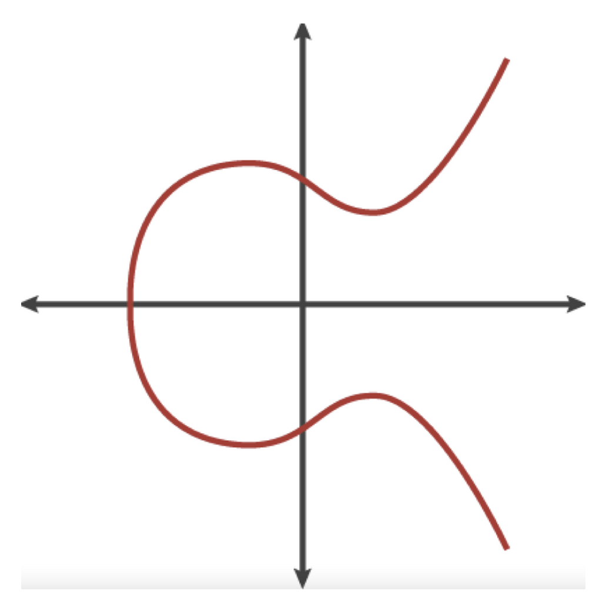
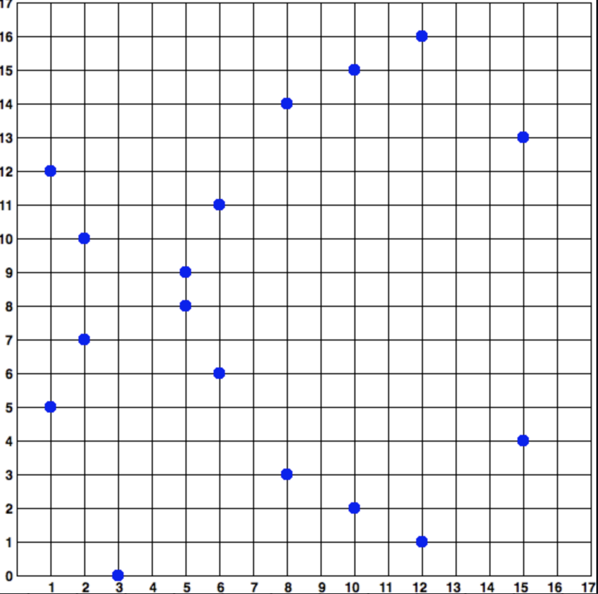
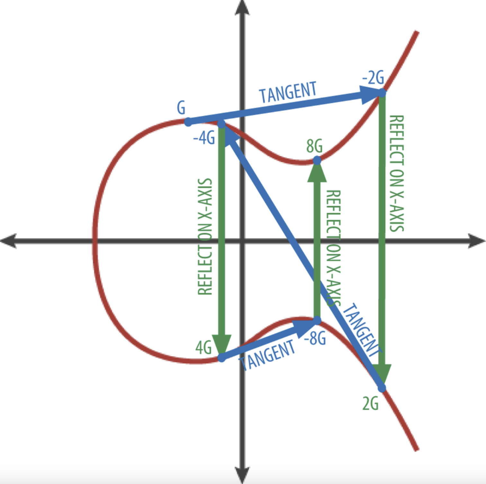

- [SM2国密算法](#sm2国密算法)
  - [椭圆曲线密码学基础](#椭圆曲线密码学基础)
    - [生成公钥](#生成公钥)
    - [ECC签名](#ecc签名)
    - [ECC验签](#ecc验签)
  - [SM2算法](#sm2算法)
    - [SM2参数定义](#sm2参数定义)
    - [SM2签名步骤](#sm2签名步骤)
    - [SM2验签步骤](#sm2验签步骤)
- [参考资料](#参考资料)

# SM2国密算法

## 椭圆曲线密码学基础
椭圆曲线密码学算法是一种基于离散对数问题的非对称或者公钥密码学算法，可以用对椭圆曲线上的点进行加法或乘法运算来表达。

下图是一个椭圆曲线的示例:


比特币使用了secp256k1标准所定义的一种特殊的椭圆曲线和一系列数学常数。该标准由美国国家标准与技术研究院 （NIST）建立。secp256k1曲线由下述函数定义，该函数可产生一条椭圆曲线：

$$
 y^2\ mod\ p = (x^3 + 7)\ mod\ p
$$

上述mod p（素数p取模）表明该曲线是在素数阶p的有限域内，也写作Fp，其中 $p = 2^{256} - 2^{32} - 2^9 - 2^8 - 2^7 - 2^6 - 2^4 - 1$， 这是个非常大的素数。

因为这条曲线被定义在一个素数阶的有限域内，而不是定义在实数范围，它的函数图像看起来像二维的离散的点，因此很难可视化。不过，该公式与实数的椭圆曲线数学公式是相似的。为了举例，下图显示了在一个小了很多的素数阶17的有限域内的椭圆曲线，其形式为网格上的一系列散点。而secp256k1的比特币椭圆曲线可以被想象成一个更大的网格上一系列更为复杂的散点。



>椭圆曲线密码学F(p)上的椭圆曲线，其中p = 17
>

比如，下面是 secp256k1 曲线上的点P，其坐标为(x，y)。

```
`P = (55066263022277343669578718895168534326250603453777594175500187360389116729240, 32670510020758816978083085130507043184471273380659243275938904335757337482424)`
```

在椭圆曲线数学中，有一个点被称为"无穷远点"，这大致相当于0的作用。计算机中，它有时表示为X = Y = 0（虽然这不满足椭圆曲线方程，但这是一个可以单独检查的例子）。

还有一个 + 运算符，被称为"加法"，就像小学数学中的实数相加。给定椭圆曲线上的两个点P1和P2，则椭圆曲线上必定有第三点 P3 = P1 + P2。

从几何学上说，该第三点P3可以在P1和P2之间画一条线来计算出来的。这条直线恰好与椭圆曲线相交于另外一个地方。此点记为 P3'= (x，y)。然后，基于x轴的对称点就是 P3=(x，-y)。

下面是几个解释为何需要"无穷远点"的特殊例子。

若 P1和 P2是同一点，那么P1和P2之间的连线延长就会与曲线相切于P1处。该切线将会与曲线相交于一个新的点。该切线的斜率可用微积分求得。尽管我们只局限在曲线上两个整数坐标的那个点，但这个机制是没问题的。

在某些情况下（即，如果P1和P2具有相同的x值，不同的y值），则切线会完全垂直，在这种情况下，P3 = "无穷远点"。

若P1就是"无穷远点"，那么其和 P1 + P2= P2。类似地，当P2是无穷远点，则P1+ P2 = P1。这表明无穷远点类似于0的角色。

事实证明，在这里 + 运算符遵守结合律，即(A+B)+C = A+(B+C)。这就是说我们可以书写成 A + B + C，不加括号也可以，而不至于混淆。

至此，我们已经定义了椭圆加法，我们可以用标准方法对加法进行扩展，来定义乘法。给定椭圆曲线上的点P，如果k是整数，则 kP = P + P + P + …+ P（k次）。注意，在这种情况下k有时被混淆了称为"指数"。

### 生成公钥

以一个随机生成的私钥k为起点，将其乘以曲线上一个预定的点，叫做生成点G得到曲线上的另一点，这就是相应的公钥 K。生成点是secp256k1标准的一部分，比特币密钥的生成点都是相同的：

```
{K = k * G}
```

其中k是私钥，G是生成点，在该曲线上所得的点K是公钥。因为所有比特币用户的生成点是相同的，一个私钥k乘以G将得到相同的公钥K。k和K之间的关系是固定的，但只能单向运算，即从k得到K。这就是可以把比特币地址（K的衍生） 与任何人共享而不会泄露私钥（k）的原因。

>提示 因为其中的数学运算是单向的，所以私钥可以转换为公钥，但公钥不能转换回私钥。
>

实现了椭圆曲线乘法，我们用之前产生的私钥k和与生成点G相乘得到公钥K：

```
K = 1E99423A4ED27608A15A2616A2B0E9E52CED330AC530EDCC32C8FFC6A526AEDD * G
```

公钥K 被定义为一个点 K = (x, y)：

```
K = (x, y) 

其中，

x = F028892BAD7ED57D2FB57BF33081D5CFCF6F9ED3D3D7F159C2E2FFF579DC341A 
y = 07CF33DA18BD734C600B96A72BBC4749D5141C90EC8AC328AE52DDFE2E505BDB
```

为了可视化展示整数与点的乘积，我们使用实数范围的简化的椭圆曲线。请记住，其中的数学原理是相同的。我们的目标是找到生成点G的倍数kG。也就是将G相加k次。在椭圆曲线中，点的相加等于该点的切线与曲线相交的那个点，该点基于x轴的对称点。

下图显示了在曲线上得到 G、2G、4G 的几何做法。




### ECC签名

签名前，需对椭圆曲线参数进行初始化，即设置椭圆曲线的a,b,p,n及基点G的坐标（x，y）。

1. 对明文m进行hash算法得到hash值e，该hash算法通常为SHA-2（而在SM2签名验签中，hash算法为SM3）。

2. 若hash值e的bit长度高于了椭圆曲线G点的阶n的bit长度，则需要对e值从高位进行截取，截取的bit数为阶n的bit数，得到结果为z。（例如阶n的值为9，其二进制bit表示为1001，而e值为18 ，其二进制bit为10010。e值的bit数高于n，因而对e进行高位截取，截取长度为4，截取后，z值的二进制为1001即为9 ）若e的bit数小于n，则e值就是z值。

3. 产生一随机数k，使其满足 1 ≤ k ≤ ( n - 1 )

4. 此时利用ECC曲线的倍点算法，对曲线的基点G进行k倍点运算，即计算Point(x1, y1) = k * G。
   取出k倍G点的横坐标x1，然后对其进行模n运算。即r = x1 mod n。如果r为0，则回到第3步重新计算

   读取私钥中的数据da，然后根据公式：

   $s = (k^{-1}(z + r*da))\quad mod \quad n$

   计算s值（k ^ -1表示对k进行模逆运算）。若s为0，则返回第三步重新计算。

5. ECC的签名数据即为（r，s）组合


### ECC验签

1. 判断签名数据（r，s）是否可用，若 1 ≤ r <= (n - 1) 且 1 ≤ s ≤ (n - 1)则合法，反之不合法。

2. 对明文m进行hash算法得到hash值e，该hash算法通常为SHA-2。

3. 若hash值e的bit长度高于了椭圆曲线G点的阶n的bit长度，则需要对e值从高位进行截取，截取的bit数为阶n的bit数，得到结果为z。若e的bit数小于n，则e值就是z值。

4. 对s进行模拟运算得到w 即

    $w = s ^ {-1} \quad mod \quad n$

5. 利用公式计算u1和u2即：u1= z * w mod n 及 u2 = r * w mod n

6. 读取公钥数据QA(公钥的数据实际上为椭圆曲线上的一个点,ECC签名算法中公钥与私钥的关系为 QA = G * da。然后根据公式对其进行椭圆曲线的点加及倍点计算。即：Point(x1, y1) = u1 * G + u2 * QA。

7. 取出点加结果的横坐标x1，对其取模得到r'，即r' = x1 mod n。若r' 等于r值，则验签成功，否则验签失败。


## SM2算法

### SM2参数定义

SM2使用素数域256位椭圆曲线，推荐曲线参数如下：

$y^2 = x^3 + ax + b。$

```
推荐曲线参数：
p=FFFFFFFE FFFFFFFF FFFFFFFF FFFFFFFF FFFFFFFF 00000000 FFFFFFFF FFFFFFFF
a=FFFFFFFE FFFFFFFF FFFFFFFF FFFFFFFF FFFFFFFF 00000000 FFFFFFFF FFFFFFFC
b=28E9FA9E 9D9F5E34 4D5A9E4B CF6509A7 F39789F5 15AB8F92 DDBCBD41 4D940E93
n=FFFFFFFE FFFFFFFF FFFFFFFF FFFFFFFF 7203DF6B 21C6052B 53BBF409 39D54123
Gx=32C4AE2C 1F198119 5F990446 6A39C994 8FE30BBF F2660BE1 715A4589 334C74C7
Gy=BC3736A2 F4F6779C 59BDCEE3 6B692153 D0A9877C C62A4740 02DF32E5 2139F0A0
```

其中P是一个素数，N为G点的阶（可简单理解为在一个群有多少个点就叫做这个群的"阶"（order））。

初始化曲线代码如下：

```
func initP256Sm2() {
	sm2P256.CurveParams = &elliptic.CurveParams{Name: "SM2-P-256"} // sm2
	A, _ := new(big.Int).SetString("FFFFFFFEFFFFFFFFFFFFFFFFFFFFFFFFFFFFFFFF00000000FFFFFFFFFFFFFFFC", 16)
	// SM2椭	椭 圆 曲 线 公 钥 密 码 算 法 推 荐 曲 线 参 数
	sm2P256.P, _ = new(big.Int).SetString("FFFFFFFEFFFFFFFFFFFFFFFFFFFFFFFFFFFFFFFF00000000FFFFFFFFFFFFFFFF", 16)
	sm2P256.N, _ = new(big.Int).SetString("FFFFFFFEFFFFFFFFFFFFFFFFFFFFFFFF7203DF6B21C6052B53BBF40939D54123", 16)
	sm2P256.B, _ = new(big.Int).SetString("28E9FA9E9D9F5E344D5A9E4BCF6509A7F39789F515AB8F92DDBCBD414D940E93", 16)
	sm2P256.Gx, _ = new(big.Int).SetString("32C4AE2C1F1981195F9904466A39C9948FE30BBFF2660BE1715A4589334C74C7", 16)
	sm2P256.Gy, _ = new(big.Int).SetString("BC3736A2F4F6779C59BDCEE36B692153D0A9877CC62A474002DF32E52139F0A0", 16)
	sm2P256.RInverse, _ = new(big.Int).SetString("7ffffffd80000002fffffffe000000017ffffffe800000037ffffffc80000002", 16)
	sm2P256.BitSize = 256
	sm2P256FromBig(&sm2P256.a, A)
	sm2P256FromBig(&sm2P256.gx, sm2P256.Gx)
	sm2P256FromBig(&sm2P256.gy, sm2P256.Gy)
	sm2P256FromBig(&sm2P256.b, sm2P256.B)
}
```

### SM2签名步骤

1. 计算明文的Hash值

    a) 按照如下方式，对参数信息进行拼接，得到数据Za'

    |字段值|sizeof(ID)|ID|a|b|Gx|Gy|Px|Py|
    |----|----|----|----|----|----|----|----|----|----|
    |字段长度(byte)|2|N(等于ID的长度)|椭圆曲线参数P的字节长度|椭圆曲线参数P的字节长度|椭圆曲线参数P的字节长度|椭圆曲线参数P的字节长度|椭圆曲线参数P的字节长度|椭圆曲线参数P的字节长度|
    |意义|ID字段的Bit长度|用户标识|椭圆曲线a参数|椭圆曲线b参数|椭圆曲线G点的X坐标|椭圆曲线G点的Y坐标|公钥的X坐标|公钥的Y坐标|

    由于SM2是基于ECC 256Bit的椭圆曲线算法，因而P参数的字节长度为32字节。

    b) 对Za'进行Hash运算（这种Hash 算法为SM3 Hash算法），得到Za。即Za = SM3(Za')

    c) 再将Za值与明文M进行拼接，得到结果M'。即 M' = Za || M

    d)再对拼接后的结果M'进行Hash(SM3)运算，得到结果e。即 e = SM3(M')

2. 产生一个随机数K，使得其满足。1 ≤ k ≤ n - 1 (这点与ECC签名算法一致)

3. 利用椭圆曲线的倍点算法，计算基点G的K倍点。即Point(x1,y1) = k * G (这点与ECC签名算法一致)。

4. 读取Point的横坐标x1, 然后对e与x1进行模加法运算，得到r值。即：r = ( e + x1 ) mod n。如果r等于0,或者r + k 等于n值，则返回第2步奏，重新计算。

5. 读取私钥数据da，计算 1 + da在n上的模逆值da_inverse。即：

    $da\_incerse = (1 + da)^{-1} \quad mod \quad n$

6. 根据公式k - r * da计算tmp值，即tmp = (k - (r * da)mod n) mod n。

7. 最后对da_inverse与tmp进行模乘计算得到s。即s = (da_inverse * tmp) mod n

8. SM2的签名数据即为（r，s）组合。

```
func Sm2Sign(priv *PrivateKey, msg, uid []byte, random io.Reader) (r, s *big.Int, err error) {
	// 1.获取明文消息哈希值 e
	digest, err := priv.PublicKey.Sm3Digest(msg, uid)
	if err != nil {
		return nil, nil, err
	}
	e := new(big.Int).SetBytes(digest)
	c := priv.PublicKey.Curve
	N := c.Params().N
	if N.Sign() == 0 {
		return nil, nil, errZeroParam
	}
	var k *big.Int
	for { // 调整算法细节以实现SM2
		for {
			// 2. 产生随机数 k
			k, err = randFieldElement(c, random)
			if err != nil {
				r = nil
				return
			}
			// 3. Point(x1,y1) = k * G, 这里取 x1 = r
			r, _ = priv.Curve.ScalarBaseMult(k.Bytes())
			// 4. r = ( e + x1 ) mod n
			r.Add(r, e)
			r.Mod(r, N)
			if r.Sign() != 0 {
				if t := new(big.Int).Add(r, k); t.Cmp(N) != 0 {
					break
				}
			}

		}
		// 6. 根据公式 k - r * da 计算 s 值，即 s = (k - (r * da)mod n) mod n。
		rD := new(big.Int).Mul(priv.D, r)
		s = new(big.Int).Sub(k, rD)
		// 5. 读取私钥数据da，计算 1 + da在n上的模逆值da_inverse
		d1 := new(big.Int).Add(priv.D, one)
		d1Inv := new(big.Int).ModInverse(d1, N)
		// 7. 最后对 da_inverse 与 s 进行模乘计算得到s。即s = (da_inverse * s) mod n
		s.Mul(s, d1Inv)
		s.Mod(s, N)
		if s.Sign() != 0 {
			break
		}
	}
	return
}
```

### SM2验签步骤

1. 同签名步骤1一样，计算明文的hash值 e。

2. 读取签名数据里的s参数，然后利用椭圆曲线的倍点算法计算基点G的s倍点，即point(x0, y0) = s * G。

3. 对签名数据里的r与s进行模加法，得到t。即 t = (r + s) mod n。然后利用椭圆曲线的倍点算法对公钥数据P(同ECC一样，其公钥数据也是ECC曲线上点)进行t倍点运算。即：tmp(x1, y1) = t * P。

4. 利用椭圆曲线点加算法对tmp和point进行点加运算，即 sum(x, y) = tmp + point。读取sum的横坐标x，使其与e值进行模加运算得到r'，即：r' = ( x + e ) mod n。 若r'与签名数据的r数据一致，则验签通过，反之则不通过。

```
func Sm2Verify(pub *PublicKey, msg, uid []byte, r, s *big.Int) bool {
  
	c := pub.Curve
	N := c.Params().N
	one := new(big.Int).SetInt64(1)
	if r.Cmp(one) < 0 || s.Cmp(one) < 0 {
		return false
	}
	if r.Cmp(N) >= 0 || s.Cmp(N) >= 0 {
		return false
	}
	if len(uid) == 0 {
		uid = default_uid
	}
  // 1. 计算明文的hash值 e
	za, err := ZA(pub, uid)
	if err != nil {
		return false
	}
	e, err := msgHash(za, msg)
	if err != nil {
		return false
	}
  // 3.1 t = (r + s) mod n
	t := new(big.Int).Add(r, s)
	t.Mod(t, N)
	if t.Sign() == 0 {
		return false
	}
	var x *big.Int
  // 2. point(x1, y1) = s * G。
	x1, y1 := c.ScalarBaseMult(s.Bytes())
  // 3.2 tmp(x2, y2) = t * P 
	x2, y2 := c.ScalarMult(pub.X, pub.Y, t.Bytes())
  // 4.1 sum(x, y) = tmp + point
	x, _ = c.Add(x1, y1, x2, y2)
	// 4.2 r = ( x + e ) mod n
	x.Add(x, e)
	x.Mod(x, N)
 // 4.3 比较x和r
	return x.Cmp(r) == 0
}
```

# 参考资料
1. [精通比特币中文翻译](https://github.com/tianmingyun/MasterBitcoin2CN)
2. [同济Go语言SM2实现](https://github.com/tjfoc/gmsm)